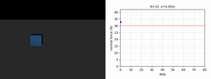
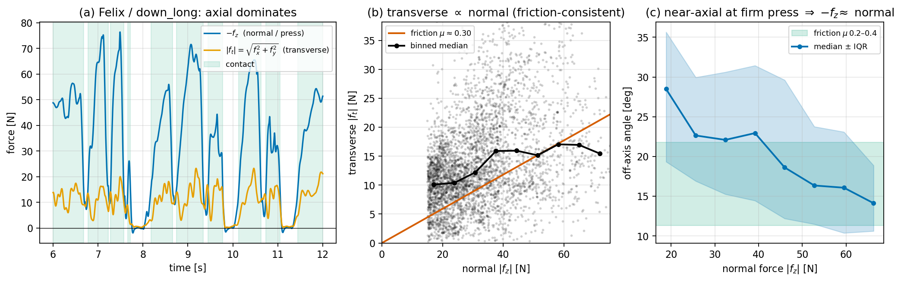

# Identifiability & validation

A cost recovered by IRL is only as trustworthy as the data's ability to
*distinguish* its features. If two features produce nearly the same gradient,
the optimizer cannot tell them apart and their weights are set by the
regularizer, not the demonstration. This page collects the tools we use to ask
**which weights the data actually pins down** — the KKT sensitivity analysis,
the box-slide toy ablations that stress-test the pipeline against a known
ground truth, and the normal-force approximation that the whole contact model
rests on.

---

## Identifiability via KKT sensitivity

Identifiability asks whether the weight vector $w$ can be uniquely recovered. We
answer it by differentiating the solver's optimality (KKT) conditions with
respect to $w$.

### Sensitivity via implicit differentiation

With Lagrangian $\mathcal{L}(z, \lambda, w) = w^\top \phi(z) + \lambda^\top g(z)$,
differentiating the KKT conditions through the Implicit Function Theorem gives
the **trajectory sensitivity matrix** $S_z = dz/dw$:

$$S_z \;=\; -\,\bigl[\text{KKT matrix}\bigr]^{-1}_{[\text{primal block}]}\,\nabla_{zw}\mathcal{L}.$$

The **feature Jacobian** $H = d\phi/dw = (\partial\phi/\partial z)\,S_z$ then
exposes redundancy through its SVD, $H = U\Sigma V^\top$. The SVD answers two
distinct questions:

- **Structural identifiability — the rank.** A zero singular value marks a
  feature combination the trajectory cannot distinguish; its singular vectors
  *name* the redundant weight pair.
- **Magnitude identifiability — the conditioning.** The objective has
  Gauss–Newton curvature $H^\top H = V\Sigma^2 V^\top$, so the Laplace weight
  covariance is $\propto V\Sigma^{-2}V^\top$. A small-but-nonzero $\sigma_j$ is a
  **soft direction**: its *direction* is constrained but its *magnitude* is
  barely pinned. A full-rank problem can still hide weight ratios the data
  cannot resolve.

Applied to the 9-DOF scraping OCP with the fully per-joint-split library (18
features), the **whole-stroke** $H$ has rank **15** and a spectrum spanning
$\sigma_1 \approx 1.1\times10^{4}$ down to $1.6\times10^{-2}$
($\kappa \approx 7\times10^{5}$). The per-segment torque terms are collinear —
which is exactly why the final runs use the pruned
[16-feature library](method#per-joint-group-split-the-16-feature-library):
energy stays split per joint, but torque collapses to three groups.

### What the whole-stroke spectrum conflates

A single SVD of the *integrated* features cannot, on its own, say **why** a
direction is soft, because each feature is a time integral
$\phi_i = \sum_t \phi_i(z_t)$ and the marginal sums the time axis away. Two
features can collapse into one small singular value for two very different
reasons:

1. **Pointwise collinear** — $\phi_a(t) \propto \phi_b(t)$ at every instant. The
   redundancy is genuine and survives in any sub-window. *The per-segment torque
   collapse is of this kind*: the scrape drives the segments through one tightly
   coupled kinematic pattern, so their torques rise and fall together
   instant-by-instant.
2. **Collinear only after integration** — per-step contributions have different
   time support or opposite trends, yet the stroke totals happen to align. *The
   force↔effort soft direction is of this kind*: the normal force is informative
   only where the press is loaded (weak at onset/release, strong mid-press,
   absent in the reach phase), so the force weight is unidentifiable in some
   phases and identifiable in others — and a single number reports neither.

So the whole-stroke $H$ is, on its own, a screen for *pointwise* redundancy
only. A concrete instance of an *after-integration* degeneracy that is genuinely a
function of time is the **joint-acceleration (JA)** feature: its value is
concentrated at the stroke ends (where the limb accelerates and decelerates) and
near-zero through the constant-velocity middle. Its weight is therefore
identifiable at the ends and **structurally unidentifiable mid-stroke** — a
degeneracy the whole-stroke spectrum cannot report, and a term it appears to pin
down may in fact be constrained by only one short window.

### Time-resolved sensitivity

Because the re-solve that builds $S_z$ is global, the only thing that changes
phase-by-phase is **which steps we integrate**. Restricting the feature sum to a
window $W = [t_0, t_1]$ gives a windowed Jacobian $H^W$ from the *same*
re-solves, and the windows partition the stroke exactly, $\sum_W H^W = H$ — so
the time-resolved view costs **no extra solves**. Taking the SVD of each window
turns the single smallest singular value into a profile $\sigma_{\min}(t)$.
Splitting the contact stroke into onset / mid-press / release shows that
`press_force` and the distal-effort weights, *soft on the whole-stroke
spectrum*, become well-conditioned in the mid-press window — which is what
licenses keeping them in the cost. We defend the cost at a few phase anchors
rather than claiming a single global verdict.

> Driver: `experiments/run_csqp_windowed_sensitivity.py`.

### Two axes of identifiability, and the posterior

The two tools sit on a grid with a **weight axis** and a **time axis**:

| | aggregated in time | time-resolved |
|---|---|---|
| **local in weight space** (quadratic) | KKT spectrum $H^\top H$ | windowed $H^W$, $\sigma_{\min}(t)$ |
| **landscape-aware** (true loss) | Langevin posterior (stroke-constant $w$) | *future work* |

For soft directions that survive even per-window, a point estimate is set by the
regularizer, not the data, so we report a **posterior**: the Laplace covariance
$(H^\top H)^{-1}$ refined by Langevin sampling over the loss,
$p(w\mid\text{demo}) \propto e^{-L(w)}$, which walks the true landscape and
captures the non-Gaussian valley along a soft direction that the quadratic Laplace
approximation misses — splitting $w$ into a trustworthy identified projection plus
a band along the free axes. The remaining cell — a Langevin posterior over the
*time-varying* $w(t)$ together with a continuous $\sigma_{\min}(t)$ — we leave to
future work as a coherent KKT-sensitivity framework.

### A feasibility caveat on the 9-DOF numbers

The 9-DOF spectrum above is **exploratory, not yet quantitatively reportable.**
The KKT sensitivity is valid only at a *converged, feasible* KKT point. After
re-slicing the demonstrations and updating the body models, the CSQP OCP does not
currently solve to feasibility at the analysis operating point: the
multiple-shooting **dynamics gaps do not close** (the constraints themselves are
satisfied), so the feature Jacobian is taken around a *non-stationary* point and
its rank and conditioning are unreliable. Re-establishing feasibility of the
re-sliced OCP is therefore a prerequisite — and is the practical reason the
*quantitative* identifiability analysis is confined to the box-slide toy, while the
9-DOF analysis is kept as a record of the problem structure and methods (the
whole-stroke vs. windowed Jacobian, and the Laplace-plus-Langevin posterior) that
motivate the framework.

---

## Box-slide toy problem

Before the 9-DOF arm we validate the whole pipeline on a problem with **known
ground-truth weights** $w^\star$, so recovery can be measured directly as the
direction cosine $\cos(w^\star, \hat w)$ ($1 =$ perfect) rather than by eyeballing
a trajectory fit.

**Setup.** A unit-mass block on a flat floor with two prismatic DOFs — a
horizontal *push* and a down-only vertical *press* — coupled by Coulomb friction
(press harder ⇒ larger normal force $N$ ⇒ more friction ⇒ less progress). Three
$\mathcal{O}(1)$ features exercise the hard parts: an effort regularizer, a
force-tracking term $|N - N_{\text{target}}|/N_{\text{target}}$, and a progress
term, with the friction coupling making them compete.

<em>The box-slide testbed: the same block can <strong>glide</strong> (light press,
travels far), <strong>press</strong> (hard press, barely advances), or anything in
between — the friction coupling makes effort and force trade off along one flat valley.</em>

A warm-start test confirms glide and press are **not** barrier-separated minima
but the two ends of *one flat valley*: solves seeded from each reach different
behaviour at near-identical cost ($\max|\Delta C| \approx 0.14$, unchanged under
a $20\times$ harder search). The weight is therefore only **directionally**
identifiable — the same lesson the 9-DOF KKT analysis teaches.

> The block's contact impulse chatters, so $N$ is read through a causal
> exponential-moving-average **load-cell model** ($\alpha = 0.12$), applied
> identically in rollout and demo feature extraction so the bias cancels.

### Ablation findings

One-factor ablations from a deterministic baseline ($w^\star$ known, recovery
$= \cos(w^\star, \hat w)$; repeatability $= \max|\Delta x|$ between two
fixed-weight solves, $0 =$ bit-identical):

| condition | factor changed | cosine | repeat. |
|-----------|----------------|--------|---------|
| baseline | deterministic | $0.787 \to \mathbf{0.996}$ | $0.0$ |
| sampling: fresh | RNG persists across solves | $0.787 \to 0.866$ | $\mathbf{0.74}$ |
| demo: glide | glide-regime expert | $0.592 \to 0.986$ | $0.0$ |
| demo: press | press-regime expert | $0.641 \to 0.998$ | $0.0$ |
| no press DOF | force actuator removed | $0.787 \to \mathbf{0.80}$ | $0.0$ |

Two findings shaped the 9-DOF setup:

1. **Determinism is a prerequisite, not a luxury.** The dominant factor is
   rollout repeatability. Deterministic or fixed-sample-set MPPI drives it to
   zero and recovers cosine $0.996$; fresh noise raises repeatability to $0.74$,
   the line search can no longer tell descent from sampling noise, and recovery
   falls to $0.866$. This re-attributes the "spline non-determinism" we had
   discarded to the **MJX/GPU backend** rather than to smooth control, which is
   bit-identical on CPU.
2. **Direction is easy, magnitude is conditioning.** The cosine is always high,
   but weight *magnitudes* are pinned only when $H$ is well-conditioned, which
   here is set by **contact stiffness**: a stiff contact ($\kappa = 6.8$)
   recovers the force weight to $0.55 \approx 0.5$, a soft one ($\kappa = 18.5$)
   over-estimates it to $1.0$ — same rank, different conditioning. Moving along
   the effort↔force soft direction leaves the motion invariant but changes the
   contact force ($\Delta N \approx 8$ N), so a **force observation** is what
   breaks a degeneracy that kinematics alone cannot. This is the box-slide echo
   of the 9-DOF rank deficiency, and the reason we judge recovery by magnitude
   and report a posterior, not a cosine.

For time-varying weights the magnitude weakness repeats at every step: $w(t)$
recovers in *shape* (per-step cosine $\sim 0.9$) but under-recovers in
*amplitude*, and a few structured basis functions beat a dense one whose surplus
coefficients are gradient-starved — which is why the 9-DOF runs use a low-order
Gaussian basis rather than per-step weights (see
[time-varying weights](method#time-varying-weights-windowed-vs-basis)).

> Injecting dry stiction *does* build a genuine barrier — which MPPI's sampling
> escapes once the exploration $\sigma$ exceeds the breakaway and a deterministic
> solver does not. That is the one place stochastic rollouts earn their cost.

### A force cost is identifiable only when an input *actuates* the force

The effort↔force trade-off above can be resolved only if some control input can
*vary* the contact force. We isolate this necessity with a one-factor ablation
that **removes the block's dedicated press actuator while keeping the
force-tracking feature**: the block may slide but not press, so the normal force
is pinned at $N = mg$ and *no* trajectory can change it. Recovery then collapses —
the force weight is driven to $0.94$ (true $0.50$), the direction cosine drops
from $0.95$ to $0.80$, and the optimality gap cannot decrease
($0.0069 \to 0.0068$) because the feature is now constant in $w$. This is a
**structural, noise-free failure** — deterministic, well-conditioned — so it is
attributable solely to the missing degree of freedom.

| | true $w^\star$ (norm) | **press DOF ON** | **press DOF OFF** (`--no-press`) |
|---|---|---|---|
| force weight | $0.500$ | $\mathbf{0.576}$ (recovered) | $\mathbf{0.944}$ (not recovered) |
| cosine to $w^\star$ | — | $\mathbf{0.952}$ | $0.803$ |
| opt. gap | — | $0.0058 \to \mathbf{0.0049}$ (improves) | $0.0069 \to 0.0068$ (stuck) |

A force cost is therefore identifiable **only when an input actuates the contact
force**, and the ablation removes the only such input the box has. *Which* input
plays that role is then system-specific. On the 9-DOF arm the answer is different:
the **joint torques themselves** actuate the contact force, since pressing harder
means spending torque along the contact-normal direction $\mathbf{J}_n^\top$ — so
the force is identifiable there *in principle*, and the distinction between our two
solvers is *how* each makes that input available, not whether it exists.

## Why a force weight needs the right inner solver

Recovering a force *weight* requires three distinct things, and separating them
dissolves an apparent paradox (if the torques produce the force, why is the weight
not simply read off them?).

**1. An input must *produce* the force.** The box ablation (above) shows that
removing the only force-actuating input collapses recovery even though the feature
is unchanged. On the arm this input exists — the joint torques drive the contact —
but the per-joint torque features are *not* a substitute for a force term: the
contact normal is a single, small projection of the torque
($\mathbf{J}_c^\top$), nearly invisible to a total-torque penalty, so a dedicated
press term is what carries the *intent to press*.

**2. The optimizer must *excite* the force.** The feature-matching gradient on the
press weight is informative only if the candidate trajectories *vary* their
contact force in response to it. This is where the two solvers part:

- The **constrained OCP** carries the force as the explicit contact dual
  $\boldsymbol\lambda$ — a decision variable the cost shapes directly — so its
  sensitivity to the press weight is exact and deterministic. No exploration is
  needed and the magnitude is recovered cleanly.
- The **sampling MPPI** has no such variable; it must produce the force through
  the joint torques and read it back. Its exploration covariance
  $\boldsymbol\Sigma = \alpha\,\mathbf{J}^\top\mathbf{J} + \beta\mathbf{I}$ is
  shaped by the end-effector Jacobian — it samples *motion of the hand*. But
  pressing harder is a **no-motion, internal-force direction** (one pushes into
  the rock without moving the end effector), nearly orthogonal to the sampled
  motion directions, so the cloud barely varies its press force and the weight
  stays weakly conditioned. Exposing that direction as a scalar press control
  $\boldsymbol\tau \mathrel{+}= \text{press\_amp}\cdot\mathbf{J}_n$ (along the
  contact normal) restores the missing exploration — the sampling analog of the
  explicit dual.

The deeper reason the dual earns its place is what a force cost *is*: because the
contact force is the **dynamics residual**

$$\mathbf{J}_c^\top \boldsymbol\lambda = \mathbf{M}\ddot{\mathbf{q}} + \mathbf{C} + \mathbf{G} - \boldsymbol\tau,$$

a cost that reproduces the demonstrated kinematics and effort *already* reproduces
the force as their consequence. Pinning it as a separately *regulated* magnitude
is what an explicit decision variable does for free and a motion-shaped sampler
must be coaxed into.

**3. Conditioning bounds the magnitude — but only once the force is actuated.** In
the box-slide, where a dedicated actuator drives the contact directly, this
conditioning is set by contact stiffness. On the 9-DOF arm this lever **does not
transfer**: sweeping the synthetic press recovery at a four-times-stiffer contact
(solref time-constant $0.2 \to 0.05$ s) left the recovered weight at its seed
across $w^\star \in \{2, 10, 30\}$ (recovered $\{5.0, 5.7, 5.0\}$ from a seed of
$5$), with no trend. The binding constraint is the **actuation channel**, not the
contact conditioning.

> Practical guidance: where the pressing force is itself the intent to be
> recovered, carry the contact reaction as an explicit decision variable, or — in
> a sampler — add a dedicated control along the contact normal. Supplying that
> control on the arm gives the press weight real authority over the force (a
> force-sweep at press weights $\{10, 30, 60\}$ yields a monotone mean force
> $\{20, 26, 28\}$ N once EMA-smoothed), but the *per-step* contact force remains
> noisy, so the sampler recovers the force's **direction/level, not cleanly its
> magnitude** — the constrained dual is what makes the *weight* recoverable.

---

## Normal-force approximation $f_n = -f_z$

The force/torque sensor reports a three-axis force in the handle frame; we take
the pressing force as the axial component, $f_n = -f_z$, modeling the stick as
held perpendicular to the rock. The approximation is justified **geometrically**,
independent of how the transverse force is interpreted.

- **(a)** During contact the axial (press) component dominates the transverse
  $|f_t| = \sqrt{f_x^2 + f_y^2}$.
- **(c)** The off-axis angle $\arctan(|f_t|/|f_z|)$ *decreases as the press firms
  up*, reaching $\sim 14^\circ$ at the largest forces. There the true normal
  lies between $-f_z$ and $|f|$, which differ by only
  $1 - \cos 14^\circ \approx 3\%$ — so $-f_z$ brackets the normal to within a few
  percent *where it is large*. At light contact the angle rises to $\sim 28^\circ$,
  but those samples carry little normal force, so the absolute error stays small.
- **(b)** The transverse components are plausibly tangential — their binned
  median grows in proportion to the normal force, consistent with Coulomb
  friction at $\mu \approx 0.3$. (A consistency check, **not** a proof: a fixed
  tool tilt produces the same $|f_t| \propto f_n$ signature. Magnitude alone
  cannot separate friction from a fixed tilt — only the transverse *direction*
  could, since it **reverses with stroke direction for friction but not for
  tilt**.)

### Effective friction coefficient

We estimate $\mu$ by matching the contact model's Coulomb reaction $\mu f_n$ to
the measured tangential force — the only $\mu$-sensitive observable. For the 1-D
sliding contact this reduces to the $f_n^2$-weighted slope
$\hat\mu = \sum_t f_n|f_t| / \sum_t f_n^2$ over the contact phase, the weighting
emphasising firm contact where the perpendicular model holds.

On the firm pressing strokes (`down_long`, where $f_n$ spans a wide range so
$\mu$ is well determined) the estimate is consistent across subjects,
$\hat\mu = 0.23$–$0.29$; we adopt $\mu \approx 0.25$. Light and return strokes
minimise at larger, scattered values — inflated by a **press-independent**
tangential force (material removal, i.e. the cutting work that *is* the task),
not by friction — so $\mu$ is read off the firm presses rather than pooled. An
intercept fit $|f_t| = \mu f_n + c$ partly separates the two: firm strokes give a
friction-like slope $\sim 0.2$ with small $c \approx 2$–$5$ N, whereas light
strokes' slope collapses while $c$ grows to $5$–$11$ N. A through-origin pooled
fit balloons to $\mu = 0.4$ for exactly this reason — the constant masquerades as
slope at low $f_n$.

> Figures: `papers/figures/force_normal_justification.png`,
> `papers/figures/friction_mu_sweep.png`. See the
> [methodology paper](https://github.com/Anastasija42/tool_handling/blob/master/papers/methodology_paper.tex)
> appendix for the full derivation.

---

## Basis order and weight parametrization

We validate the choice of weight parametrization on the long down-stroke (S2,
five-train / five-held-out), sweeping the Gaussian-basis order $K$ and the
windowed alternative. Three findings emerge.

**Accuracy is insensitive to basis order.** Held-out joint RMSE is flat across
basis $K$ from $2$ to per-step ($4.2$–$4.4^\circ$): no underfit at $K=2$, no
overfit at per-step. The recovered cost for this sustained-contact stroke is
essentially *time-constant* — even per-node weights converge to a flat $w(t)$ —
so there is no temporal structure for a higher-order basis to capture or overfit.
(Phase-dependent weighting would matter more for the short, air–scrape–air
strokes, which are not identifiable.)

**Conditioning, not accuracy, distinguishes the order.** A low-order basis is
well-conditioned: $K=12$ recovers identically with or without the ridge
($\text{train} \approx 4.5^\circ$ either way). The per-step basis is
**gradient-starved** without regularization — its training error rises to
$5.4^\circ$ (from $4.3^\circ$) when the ridge is removed, because its surplus
coefficients receive too little gradient to determine. The ridge rescues it, but a
low-order basis needs no such crutch.

**Windowed underperforms the smooth basis.** The piecewise-constant windowed
parametrization is consistently worse, and at $n_w=12$ is the only condition with a
train→held-out gap ($4.7 \to 5.0^\circ$) — the *noisy-staircase* degeneracy:
adjacent windows are independent parameters, so a fine windowing starves each
window's gradient and shares no information across the stroke.

| Parametrization | train | held-out |
|---|---|---|
| basis $K=2$ | 4.24 | 4.32 |
| basis $K=6$ | 4.43 | 4.26 |
| basis $K=12$ | 4.47 | 4.38 |
| basis $K=24$ | 4.69 | 4.28 |
| basis per-step | 4.31 | 4.24 |
| windowed $n_w=2$ | 4.97 | 4.63 |
| windowed $n_w=12$ | 4.72 | 4.95 |
| *ridge removed ($\beta=0$):* basis $K=12$ | 4.42 | 4.34 |
| *ridge removed ($\beta=0$):* basis per-step | 5.41 | 4.72 |

This is why the 9-DOF runs use a **low-order Gaussian basis with a gentle ridge**
rather than per-step or windowed weights. (Methodology paper, Table IX.)

---

## What a recovered weight represents

The two solvers differ not only in *how* they recover a cost but in *what* a
recovered weight **is**.

The **constrained solver** returns the cost whose *exact* optimum is the
demonstration. The recovery is meaningful only where the inner optimal-control
problem converges — we therefore gate on the **KKT residual** rather than on the
feasibility flag — but once converged it is a property of the cost and the dynamics
*alone*, independent of solver settings. Consistent with this, the recovered
down-stroke cost is near-constant across basis orders and with or without the ridge
(see *Basis order* above).

The **sampling solver** instead returns the cost whose *MPPI-approximate* optimum —
a softmax over rollouts drawn from a finite-horizon, noise-shaped proposal —
reproduces the demonstration. This is meaningful only **relative to that sampler's
parameters** (horizon, sample count, exploration noise, temperature), and would
shift were they changed. Consistent with this, recovery degrades as soon as the
sampling is perturbed: re-seeding the RNG alone drops the rollout repeatability
from bit-identical to $0.74$.

The two recoveries are therefore representable in different senses — **one
absolute, contingent on convergence; the other relative to a fixed sampler** — a
distinction that a systematic sweep over horizon and sample count (left to future
work) would quantify.

---

[Home](.) | [Method](method) | [Cross-Morphology](morphology) | [Results](results) | [Gallery](gallery) | [Code](code)
