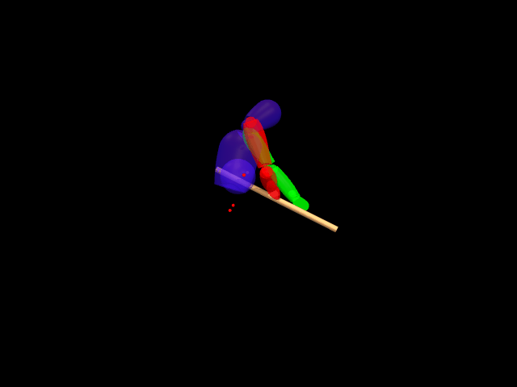
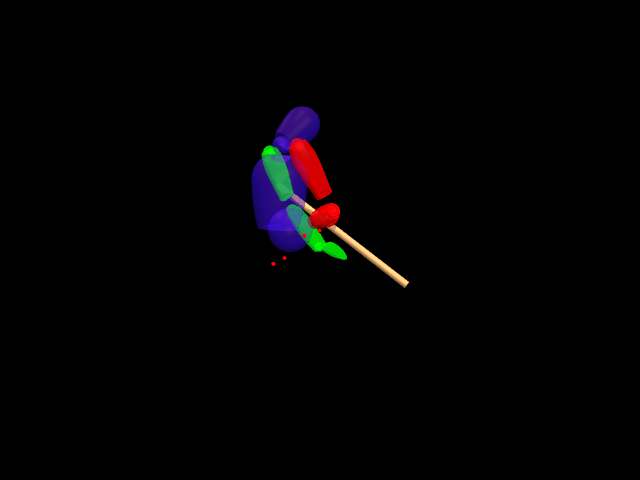
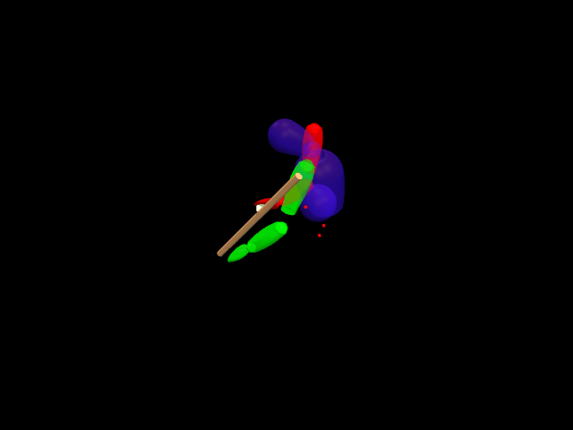
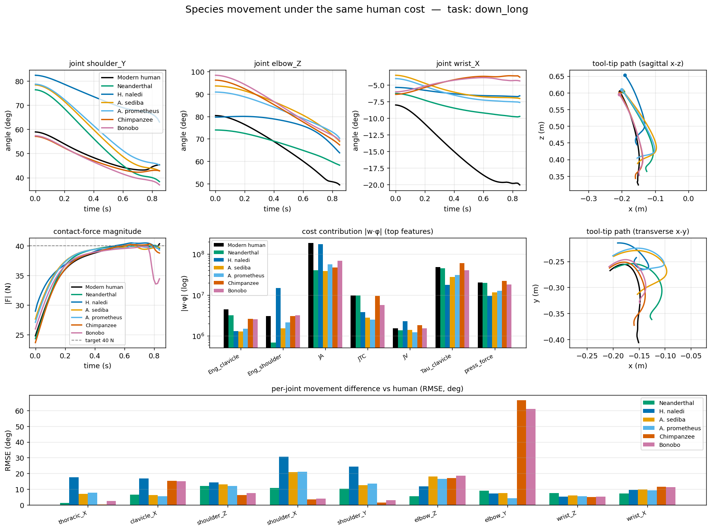

## Motivation

<em>One long down-stroke of the shaving task, recorded from three
subjects of different build and replayed on each subject's own scaled body model.
A single shared cost, learned from a few such cycles, reproduces all three.</em>

Understanding **why** humans move the way they do is central to biomechanics, prosthetics, and archaeology. We collaborate with the [Anthrotopography Lab (Archaeology/Anthropology Prof. Radu Iovita)](https://wp.nyu.edu/csho/research/laboratories/anthrotopography_laboratory/) to study **Paleolithic tool use** — how early humans shaped stone tools by pressing and scraping them against wood.

By learning the underlying **cost function** from motion capture data, we can:
- Explain movement strategies across different tool morphologies
- Predict how technique adapts to new tools
- Compare motor strategies across subjects and skill levels

## Two threads

This project has two complementary parts, each with its own page:

1. **Methodology** — a contact-aware Minimal-Observation IRL (MO-IRL) that
   recovers a *force-regulated* cost from a few shaving cycles, with two
   interchangeable inner solvers (a Crocoddyl OCP and a sampling MPPI), and a
   [KKT identifiability analysis](identifiability) of what the data can actually
   pin down. → [Method](method)
2. **Cross-morphology** — holding that human-recovered cost *fixed* and
   re-solving the same shaving task on seven hominin bodies (modern human,
   Neanderthal, *H. naledi*, *A. sediba*, *A. prometheus*, chimpanzee, bonobo), so
   behavioural divergence is attributable to morphology alone. → [Cross-Morphology](morphology)

<em>Seven bodies, one fixed human cost: joint trajectories, the
regulated contact force, where the cost is spent, and how far each body ends up
from the human solution.</em>

The shared cost predicts held-out human demonstrations at a **mean joint RMSE of
≈ 5.5°**, and transfers across bodies with a cost penalty that rises monotonically
from human and Neanderthal (< 1%) to the apes (2–3%) to *H. naledi* and the
australopiths (4–7%).

## The Task

A seated human holds a rock and scrapes it along a wooden stick — a contact-rich manipulation requiring coordinated force control and smooth motion planning. We capture this using motion capture (Evercoast volumetric capture + OptiTrack markers) and 3D scanning of the tools.

<!-- Place images in docs/assets/figures/ -->
<!--  -->

## Approach

We formulate the problem as **Inverse Reinforcement Learning (IRL)**: given the demonstrated trajectory, find cost function weights that make the demo appear optimal.

$$w^\star = \arg\max_{w}\; \sum_{\xi \in D} \log P(\xi \mid w), \qquad P(\xi \mid w) = \frac{1}{Z(w)}\, \exp\!\left(-\sum_t r_w(s_t, u_t)\right)$$

The cost function is a weighted sum of biomechanical and task-specific features:

$$C(w) \;=\; \sum_i w_i\, \phi_i$$

where each $\phi_i$ captures a different aspect of the motion — from classical biomechanical criteria (jerk, torque, energy) to task-specific ones (contact force, progress along the rail, tool orientation).

### Two Solvers

We use two complementary trajectory optimization approaches:

| | **Crocoddyl forward** | **Physics Simulator (MuJoCo + MPPI)** |
|---|---|---|
| Dynamics | Pinocchio rigid-body | MuJoCo contact solver |
| Optimizer | DDP / CSQP | MPPI (sampling-based) |
| Contact | Custom 1D friction model | Full 3D contact with friction |
| Strengths | Fast, analytical gradients | Handles complex contact, no contact schedule needed |
| Limitations | Requires known contact timing | Stochastic, slower |

The **Crocoddyl forward** approach works well for short, well-defined motions where contact timing is known. The **MPPI approach** (MuJoCo) handles longer motions and discovers contact naturally through sampling.

### Pipeline

1. **Capture** human scraping motion via motion capture
2. **Scan** tools and stick in 3D for geometry estimation
3. **Build** a subject-scaled, torque-driven rigid-body skeletal model (URDF/MuJoCo) — a 9-DOF upper limb, not a muscle model
4. **Estimate** rail path from contact point trajectory
5. **Optimize** trajectory under current cost weights
6. **Compare** features between optimized and demonstrated trajectory
7. **Update** weights via IRL gradient: $\nabla_w \mathcal{L} = \phi_{\text{demo}} - \mathbb{E}_{P(\xi \mid w)}[\phi]$
8. **Iterate** until convergence
