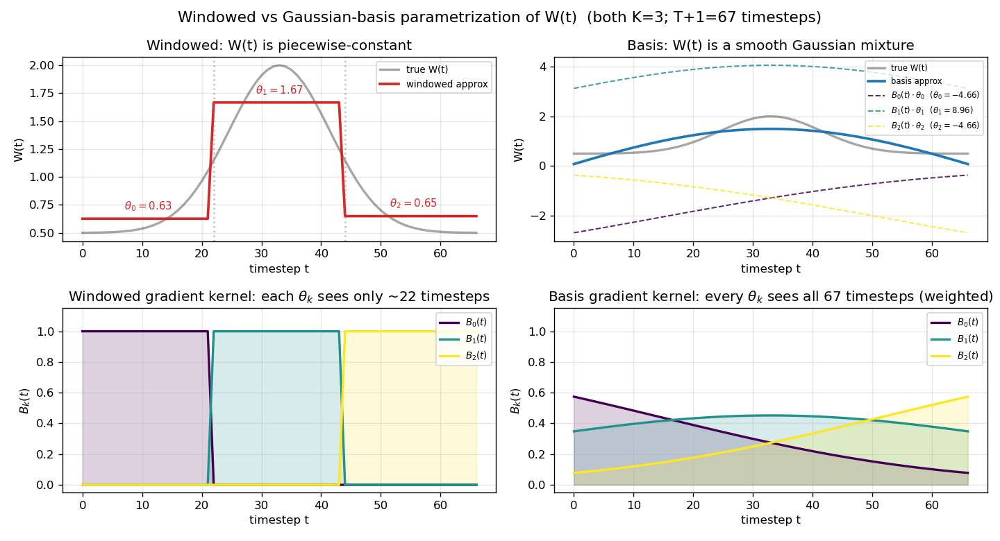
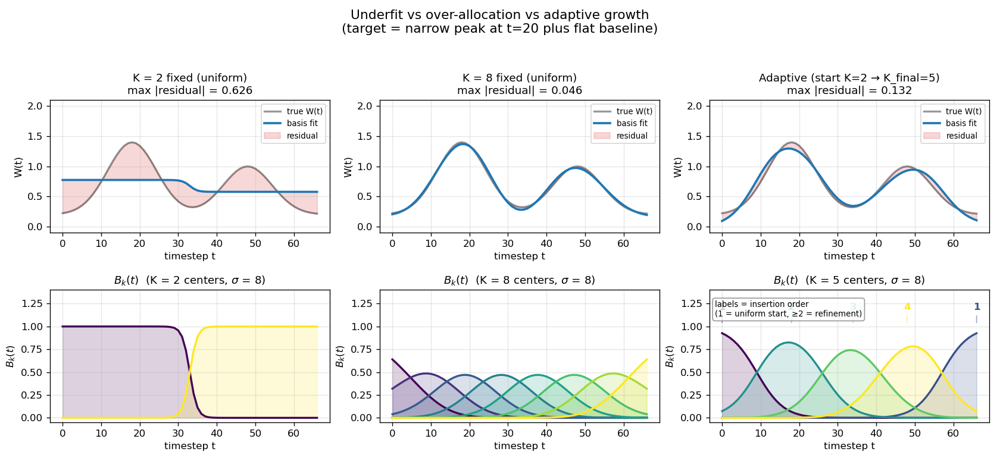

# Method

*Background — the [toy-box analogy](toy_box_analogy) builds the intuition on a small, fully-known problem before the method is trusted on real demonstrations.*

## Related Work

**The foundation of IRL.** Ng and Russell first formalized the recovery of
reward functions from demonstrations, noting the problem's inherent
ill-posedness: a single behaviour may be optimal under many different cost
functions. Early *apprenticeship learning* methods sidestepped this by matching
feature expectations rather than seeking a unique reward. **Maximum-Entropy
(MaxEnt) IRL** (Ziebart et al.) resolved the ambiguity by selecting the most
unbiased reward distribution consistent with the observed behaviour. While this
underpins most modern reward learning, it carries a computational bottleneck —
the **partition function**: the reward gradient needs a normalizer over *all*
possible trajectories, typically requiring massive datasets or expensive
sampling (e.g. MCMC) to approximate the distribution.

**The evolution of sample efficiency.** Guided Cost Learning (GCL) jointly
optimizes the cost function and the trajectory distribution and has been applied
to robotic manipulation and force tasks (e.g. learning variable impedance for
peg-in-hole insertion), but remains data-driven — relying on neural networks and
extensive inner-loop optimization, and focused on robotic impedance rather than
the biomechanical principles of human force regulation.

**Minimal-Observation IRL (MO-IRL).** To cut the data burden further, MO-IRL
introduces a *contrastive* update: instead of a global normalizer, it represents
the partition function with a single **"challenger" trajectory** — the optimal
path generated by a Direct Optimal Control (DOC) solver under the current cost
estimate — letting the model learn from as little as *one* demonstration. MO-IRL
is, however, sensitive to regularization and temporal parameters, and had not
previously been applied to complex human motion or collision constraints.

**Human biomechanics in contact.** In biomechanics, Inverse Optimal Control
(IOC) decodes the *why* behind biological movement, which is well-described by a
trade-off between **effort, smoothness, and task-tracking**. Yet most studies
treat free-space movements. When contact is involved, manipulation IRL usually
treats interaction forces as a *fixed constraint* rather than a *regulated
objective* — even though in lifting, scrubbing, or scraping the interaction force
is a primary intent of the expert. Prior work on prehistoric tool-use
instrumented the scraping gesture with a force/torque sensor and showed distinct
gestures are statistically separable by their measured dynamics (Pfleging et
al.), but stopped at *discrimination*; it did not recover the objective that
produces those dynamics.

**This work** bridges sample-efficient IRL and force-regulated biomechanics:
using a sampling-based controller (MPPI) as the inner loop to resolve contact
natively, we recover costs where the **pressing force is a first-class
objective**.

## Notation

| Symbol | Meaning |
|--------|---------|
| $\xi = (s_{0:T}, u_{0:T})$ | Trajectory: state-control sequence over horizon $T$ |
| $s_t$ | State at time $t$ (joint positions, velocities, contact state) |
| $u_t$ | Control input (commanded joint torque) at time $t$ |
| $q,\ \dot{q},\ \ddot{q}$ | Joint position, velocity, acceleration |
| $\tau$ | Physical joint torque |
| $M(q)$ | Configuration-dependent mass/inertia matrix |
| $w \in \mathbb{R}^d$ | Cost-feature weight vector (IRL parameters) |
| $\phi(\xi) \in \mathbb{R}^d$ | Feature vector summarising trajectory $\xi$ |
| $r_w(s,u) = w^\top \phi(s,u)$ | Linear reward / cost per step |
| $\mathcal{L}(w)$ | IRL log-likelihood of the demonstration |
| $Z(w)$ | Partition function of the Boltzmann trajectory distribution |
| $\phi_{\text{demo}}$ | Feature vector of the demonstration trajectory |
| $p_i$ | Softmax probability of challenger trajectory $i$ |
| $J_{\text{tool}}$ | Tool-frame Jacobian |
| $v_{\text{tool}}$ | Tool linear velocity |
| $\mu,\ F_{\text{target}}$ | Coulomb friction coefficient and target contact force |
| $\Sigma,\ \alpha,\ \beta$ | MPPI sampling covariance and its scaling parameters |
| $\varepsilon$ | Sampled control perturbation |

## Problem setup and overview

We recover a **motor objective** from a small set of demonstrated shaving
cycles. Each demonstration is a *cyclic* trajectory of a **9-DOF upper-limb
model** with state $\mathbf{x}_t=(\mathbf{q}_t,\mathbf{v}_t)$ and joint torques
$\mathbf{u}_t$. The recovered cost is a weighted sum of features
$\boldsymbol{\phi}(\mathbf{x}_t,\mathbf{u}_t)$ with **non-negative,
time-varying** weights $\mathbf{w}(t)$. The framework is an outer MO-IRL loop
that updates the weights, plus two interchangeable inner trajectory generators
that handle contact reactions in fundamentally different ways.

Contact-rich shaving differs from the contact-free reaching usually studied in
inverse optimal control in three ways:

1. **Persistent contact** — the tool exerts a *regulated* pressing force, so the
   cost must admit a force-tracking term and the dynamics must carry the contact
   reaction.
2. **Higher dimensionality** — a realistic stroke engages nine actuated
   upper-limb joints, well beyond the planar two-link arms typical of IOC.
3. **Cyclic structure** — demonstrations are individual cycles excised from a
   continuous repetitive motion, not discrete point-to-point reaches.

We validate in three stages of increasing realism: (i) a **known-ground-truth
box-slide testbed**, where planted weights are recovered and ablations reveal
what governs recovery; (ii) a **known cost planted on real shaving kinematics**,
which the full feature pipeline recovers; and (iii) the **costs recovered from
motion capture** of shaving across subjects and stroke directions. See
[Identifiability](identifiability) and [Results](results) for each stage.

## Maximum Entropy IRL

We use Maximum Entropy Inverse Reinforcement Learning, which models trajectory probability as a Boltzmann distribution:

$$P(\xi \mid w) = \frac{1}{Z(w)} \exp\!\left(-\sum_{t=0}^{T} r_w(s_t, u_t)\right)$$

The optimal weights maximize the log-likelihood of the demonstration. The gradient has an intuitive form:

$$\nabla_w \mathcal{L} \;=\; \phi_{\text{demo}} \;-\; \mathbb{E}_{P(\xi \mid w)}[\phi]$$

Weights increase for features where the **challenger trajectory is worse** than the demo — the IRL pushes the cost function to distinguish the demo from alternatives.

## Minimal Observation IRL (MO-IRL)

Rather than sampling many trajectories to estimate $\mathbb{E}[\phi]$, we use the **optimal policy mode** — the single trajectory that minimizes cost under current weights:

$$\xi^\star \;=\; \arg\min_{\xi}\; w^\top \phi(\xi)$$

This trajectory is the "hardest example" under current weights. Each iteration adds it to a growing buffer, which approximates the partition function adversarially (connection to max-margin IRL).

The weight update with a set of challenger trajectories:

$$\nabla_w \mathcal{L} \;=\; \sum_i p_i \,\bigl(\phi_i - \phi_{\text{demo}}\bigr)$$

where $p_i$ is the softmax probability of each challenger.

### Contrastive weight update (paper formulation)

MO-IRL defines the probability of a demonstrated optimal trajectory
$\mathbf{x}^*$ relative to a set of sub-optimal challengers $\bar{\mathbf{x}}$
*contrastively*:

$$P(\mathbf{x}^* \mid \mathbf{w}, \bar{\mathbf{x}})
= \frac{\exp(-\mathbf{w}^\top \boldsymbol{\Phi}^*)}
       {\sum_{\mathbf{x}_i \in \{\mathbf{x}^*\} \cup \bar{\mathbf{x}}}
        \exp(-\mathbf{w}^\top \boldsymbol{\Phi}_i)},$$

where $\boldsymbol{\Phi}$ are the **time-integrated** features. The weight update
minimizes the negative log-likelihood over $D$ trials:

$$\Delta \mathbf{w}^* = \arg\min_{\Delta \mathbf{w}}
\sum_{d=1}^{D} \left( -\log
\frac{1}{1 + \sum_{\mathbf{x}_i \in \bar{\mathbf{x}}} \gamma_i
\exp\!\big(-\Delta \mathbf{w}^\top (\boldsymbol{\Phi}_i - \boldsymbol{\Phi}_d^*)\big)}
\right)
+ \frac{\beta}{2}\,\lVert\Delta \mathbf{w}\rVert^2_2,$$

with $\beta$ a ridge regularizer that prevents over-fitting. The key mechanism is
the **scaling factor**

$$\gamma_i = \exp\!\big(-\mathbf{w}_n^\top (\boldsymbol{\Phi}_i - \boldsymbol{\Phi}^*)\big),$$

which emphasizes challengers closer to the current estimate of optimality, so the
optimizer receives the most informative signals from the approximated trajectory
space. Because the feature integrals span several orders of magnitude, the update
is conditioned by a **per-feature mask**
$1/\max(|\boldsymbol{\Phi}_{\text{demo}}|,\epsilon)$ so all features advance at
comparable rates; after each update the weights are projected so $\mathbf{w}\ge 0$.

### Regularization: a gentle ridge, and what it does

We add an $L_2$ (ridge) penalty $\tfrac{\beta}{2}\lVert\mathbf{w}\rVert^2$ with
$\beta = 10^{-3}$. Because the features are individually scaled, we **omit the
$L_1$ term of the elastic net** — in scaled space it over-shrinks small features
differentially — and keep only the ridge, which uniformly damps the **end-window
weight spikes** an under-constrained stroke would otherwise produce, without
killing small features. The ridge plays a second, deliberate role: in the weight
directions a demonstration does *not* constrain — the **soft directions** (see
[Identifiability](identifiability)) and any never-exercised DOF such as the
upright trunk — it is the *regularizer, not the data*, that sets the recovered
value. We therefore treat such unconstrained directions as **prior-set rather
than recovered**, and confine biomechanical interpretation to the directions the
data actually identifies.

## Cost Features

### Classical biomechanical criteria

Established cost functions from the motor control literature, reformulated for our optimal control framework. Each criterion captures a different intuition about what makes a motion "preferred" in human motor control.

| Criterion | Formula | Explanation |
|-----------|---------|-------------|
| **Joint acceleration** (JA) | $\int \lVert \ddot{q} \rVert^2\, dt$ | How *jerky* the motion is. Penalizes rapid changes in joint velocity — preferred motions have smoothly varying velocities (no sudden stops/starts). |
| **Torque change** (JTC) | $\int \lVert \dot{\tau} \rVert^2\, dt$ | How *rapidly the muscle effort changes* over time. Smaller values = more economical neural control (no rapid muscle firing changes). |
| **Torque** (Tau) | $\int \lVert \tau \rVert^2\, dt$ | Total *muscle effort*. Penalizes large joint torques — preferred motions use minimal force. |
| **Geodesic** (Geo) | $\int \sqrt{\dot{q}^\top M(q)\, \dot{q}}\, dt$ | The *kinetic-energy-aware path length* through joint space. Penalizes long, contorted joint paths weighted by inertia — minimizes "how much mass moves how far". |
| **Energy** (Eng) | $\int \sum_j \lvert \dot{q}_j\, \tau_j \rvert\, dt$ | Mechanical *work expended* (joint power integrated over time). Captures total caloric/metabolic cost. |
| **Joint velocity** (JV) | $\int \lVert \dot{q} \rVert^2\, dt$ | Penalty on *fast joint motion*. Distinct from JA: JV says "don't move fast"; JA says "don't change speed fast". |

### Task-specific features

Features specific to the contact-rich rock-pressing task — these encode "what the demonstrator is trying to achieve" rather than "how cheaply they can move":

| Feature | Description | Explanation |
|---------|-------------|-------------|
| **press_force** | $\big\lvert f_{\text{contact}}(t) - f_{\text{target}}(t) \big\rvert$ | How well the demonstrator *matches the target normal force* on the leather/rock. The target is per-timestep, derived from the measured force profile (see below). Captures pressing intensity. |
| **progress_vel** | $\big\lvert v_{\text{rail}}(t) - v_{\text{target}} \big\rvert^2$ | How well the *contact point's speed along the rail* matches a target velocity (default 0.5 m/s). Drives forward progress along the working line. |
| **rail_lat** | $\lVert p_{\perp \text{rail}}(t) \rVert^2$ | *Lateral drift from the rail axis*. Penalizes wobbling sideways while pressing — keeps the tool tracking the intended line. |
| **rock_ori** | rotation deviation from reference | How well the rock's *orientation* (tilt + roll) matches the intended pose. Captures grip discipline / wrist control. |

In addition to `press_force` above, a **surface** feature $\tfrac12\,\mathrm{gap}^2$ penalizes loss of contact (the rock leaving the stick when it should be pressed).

All features are normalized to $\mathcal{O}(1)$ so the learned weights directly express *relative importance* — a weight of 0.5 on `Tau` and 0.05 on `press_force` means the demonstrator implicitly prioritized minimizing torque effort 10× more than tracking the target force.

### Per-joint-group split: the 16-feature library

To localize effort to the body, the **torque (Tau)** and **energy (Eng)**
features are split per joint group — clavicle, thoracic, shoulder, elbow, and
wrist — rather than summed over the whole arm. This lets the recovered cost
distinguish *proximal load* (shoulder torque to hold the arm out) from *distal
effort* (elbow/wrist torque to drive the scrape). Energy stays split per joint;
torque collapses to three groups once the
[identifiability analysis](identifiability) shows the per-segment torque terms
are collinear (the scraping motion drives the segments through one tightly
coupled kinematic pattern). The result is the **sixteen-feature** weight vector
used in the final runs:

| Group | Features |
|-------|----------|
| Effort / smoothness | Tau (×3 joint groups), Eng (×per-joint), JV, JA, JTC, Geo |
| Contact | press_force, surface |
| Task | progress_vel, rail_lat, rock_ori |

> **Relation to the paper's Table I.** The methodology paper specifies the
> library in its canonical per-step, half-squared form — e.g.
> $\text{Tau}=\tfrac12\lVert\mathbf{u}\rVert^2$,
> $\text{Eng}=\tfrac12\lVert\mathbf{v}\odot\mathbf{u}\rVert^2$,
> $\text{Geo}=\tfrac12\,\mathbf{v}^\top\mathbf{M}\mathbf{v}$,
> $\text{press\_force}=\tfrac12(f_n-f_{\text{ref}})^2$ — with **both** Tau and
> Eng split into five joint groups (thoracic, clavicle, shoulder, elbow, wrist),
> giving an eighteen-feature library. The integral / absolute-value forms above
> are the same features written over the cycle; collapsing Tau to three groups
> (→ sixteen) is the downstream decision the
> [identifiability analysis](identifiability) justifies, once the per-segment
> torque terms turn out collinear.

### How to read the IRL weights

After learning, three quantities matter:

- **Weight $w_k$** — the IRL's confidence that this feature drives behaviour.
- **Demo's feature value $\bar{\phi}_k$** — how much of that feature the demo trajectory exhibited.
- **Cost contribution $w_k \cdot \bar{\phi}_k$** — the *true importance*: a feature can have a small weight yet contribute hugely if its $\bar{\phi}_k$ is large, and vice versa.

The cost contribution view (rather than weights alone) reveals the demonstrator's actual priority ranking.

## Force target pipeline

The contact-force feature compares the trajectory's contact force against a
**per-step target $f_{\text{target}}(t)$ derived from the measured force
profile**, not a constant scalar. The pipeline:

1. **Source selection** (3-level fallback):
   1. Per-cycle slice CSV at the current date
      (`force_slices/<dir>/cycle_NN.csv`).
   2. Raw force recording at the same date — aligned to the mocap clock and
      sliced on the fly.
   3. **Cross-date reference**: when the requested date has no force sensor
      (e.g. the 13_02 take), borrow the same subject's 27_02 cycle profile
      and resample by **normalized cycle progress** ($u \in [0,1]$) onto the
      current cycle's timegrid. This preserves the *shape* of the
      pressing-force pattern across recording sessions even though absolute
      timestamps differ.

2. **Smoothing**: a Savitzky-Golay filter (window ≈ 170 ms, polyorder 3,
   gracefully degrading on short cycles) gives a continuous, reasonable
   target to track instead of raw sensor noise.

3. **Wiring**:
   - `HumanCrocoddyl.set_force_target_profile(forces)` — see Crocoddyl
     section below for the two-layer effect on the Crocoddyl problem.
   - `HumanMPPI.set_force_target(forces)` — used inside the `press_force`
     feature evaluation as the per-step target.

Code: `irl_utils_setup.load_smoothed_force_profile`.

## Two Trajectory Optimization Approaches

### 1. Crocoddyl forward

- **Dynamics:** Pinocchio rigid-body dynamics (RNEA, ABA)
- **Solver:** CSQP / DDP (gradient-based)
- **Contact:** Custom actuation model with 1D Coulomb friction. With a
  per-step force target $f_{\text{target}}(t)$ from the smoothed measured
  profile:

$$\tau_{\text{actuation}}(t) \;=\; u(t) \;-\; J_{\text{tool}}^\top \left(\mu\, f_{\text{target}}(t)\, \frac{v_{\text{tool}}}{\lVert v_{\text{tool}} \rVert + \varepsilon}\right)$$

  The target is wired into the Crocoddyl problem at **two layers**, both per-timestep:

  - **Layer 1 — `press_force` cost residual.** Each running IAM's
    `ResidualModelContactForce` reference is set to
    $\mathrm{Force}([0,\,0,\,f_{\text{target}}(t)])$ — drives the optimizer
    toward producing the measured per-step force.
  - **Layer 2 — actuation friction.** Every running IAM is built with its
    own `ActuationModelFriction(state, frame_id, \mu, f_{\text{target}}(t))`
    so the friction reaction in the differential dynamics also tracks the
    measurement (rather than using a constant $F_{\text{target}}$ everywhere).

  Calling `human.set_force_target_profile(forces)` triggers a solver rebuild
  so each timestep gets its own actuation instance — Crocoddyl's Python
  bindings don't expose the actuation as writable on existing IAMs, so a
  rebuild is the cheapest path. With `forces=None` the model reverts to the
  original scalar `target_force`.

- **Contact phase split.** When the task supplies `tool_length` (short-stick
  scenarios), the running horizon is divided into a contact phase
  ($t < T_\text{contact}$) and a free phase ($t \ge T_\text{contact}$).
  $T_\text{contact}$ is the last demo frame whose contact-frame projection
  onto the rail axis is still within $[0, \text{tool\_length}]$. Contact-phase
  IAMs use `DifferentialActionModelContactFwdDynamics` with the rail
  constraint and include the task costs (`press_force`, `progress_vel`); free
  -phase IAMs switch to `DifferentialActionModelFreeFwdDynamics` (no contact
  constraint) and drop the task costs, keeping only the biomechanical ones.
  This lets the OCP represent demos where the rock leaves the stick mid
  -trajectory without forcing rail contact through the follow-through.

- **Strengths:** Fast convergence, smooth analytical gradients for IRL
- **Limitation:** Requires predefined contact schedule (here, derived
  kinematically from the demo trajectory and `tool_length`)

### 2. MuJoCo + MPPI (Physics Simulation)

- **Dynamics:** MuJoCo full-physics contact solver
- **Optimizer:** MPPI with Jacobian-shaped noise

$$\Sigma \;=\; \alpha\, J_{\text{tool}}^\top J_{\text{tool}} \;+\; \beta\, I$$

The $J_{\text{tool}}^\top J_{\text{tool}}$ term biases exploration toward end-effector productive joint motions. Controls build on gravity compensation:

$$u \;=\; \text{clip}\!\bigl(\tau_{\text{grav}} + U[h] + \varepsilon,\; u_{\min},\, u_{\max}\bigr)$$

**The contact force is actuated through the joint torques.** Unlike the box-slide
testbed, the arm has **no dedicated press actuator**: its only control inputs are
the joint torques $\mathbf{u}$, and the contact force enters as the
contact-Jacobian term $\mathbf{J}_c^{\top}\boldsymbol{\lambda}$ — pressing harder
means spending torque along the contact-normal direction $\mathbf{J}_n^{\top}$.
The force is thus actuated *in principle*, but the motion-shaped MPPI exploration
barely samples this no-motion direction, so we **augment the control with a
scalar press command** $a_t$ applied along the normal,

$$\mathbf{u}_t \leftarrow \mathbf{u}_t + a_t\,\mathbf{J}_n^{\top},$$

carrying its own exploration noise. All features — effort and force alike — are
evaluated on the *resulting* torque and rollout, so the press appears *inside*
the recovered effort rather than bolted on top of it. How cleanly this recovers
the force weight (direction yes, magnitude only as well as the contact is
conditioned) is analysed on the [Identifiability](identifiability) page.

- **Strengths:** Handles arbitrary contact, no schedule needed
- **Limitation:** Sampling-based (stochastic), slower per iteration

## IRL with MPPI: Key Challenges

### Separating task and behavior

The cost function must simultaneously learn:
- **What to do** — approach the stick, make progress, maintain contact
- **How to do it** — smoothly, with appropriate force, keeping orientation

These cannot be learned simultaneously because of **gradient poisoning** in the softmax probability model. The IRL gradient is weighted by a shared probability $P_{\text{nopt}}$ computed from the total cost. Features where the challenger is worse than the demo (approach — arm is far from stick) produce positive gradients, but features where the challenger is better (rock orientation — stationary arm doesn't rotate) produce negative gradients. These cancel each other inside the softmax, suppressing the gradient for ALL features.

We address this with **two-phase learning**:

1. **Phase 1:** Learn task weights only (approach, traveled) — the only features where the initial trajectory has MORE cost than the demo. Large learning rate, masked gradient.
2. **Phase 2:** Unlock all weights (task + style) starting from Phase 1 values. Now the trajectory is moving aggressively, so it has MORE of every feature than the demo — all gradients point positive and can be learned together without poisoning.

### Feature normalization

Features span orders of magnitude (joint acceleration ${\sim}10^6$, approach distance ${\sim}0.01$). Without normalization, large features dominate the gradient. We normalize all features to $\mathcal{O}(1)$ using linear norms.

### Inner weight update: two options

All that matters per IRL iteration is producing a step $dw$ such that $w_{k+1} = w_k + \eta\, dw$ improves the cost-difference objective against a freshly rolled-out trajectory. The codebase supports two ways of computing $dw$ on the current buffer $\{\phi_{\text{demo}}, \phi_1, \ldots, \phi_N\}$; both optimise the same MaxEnt log-likelihood, but they differ in how much work is spent inside a single iteration.

**Direct gradient** (`MO_IRL._compute_dw` with `use_mppi_grad=True`). One evaluation of the softmax-weighted feature difference:

$$\nabla_w \mathcal{L}(w_k) \;=\; \sum_i p_i \,\bigl(\phi_i - \phi_{\text{demo}}\bigr),
\qquad p_i \;=\; \mathrm{softmax}\!\bigl(-\lambda\, w_k^\top \phi_i\bigr).$$

$dw$ is then a single first-order (SGD) step — see the step-rule section below for why we use plain SGD rather than an adaptive method here. One gradient, one step.

**Inner L-BFGS-B** (`Optimizer.min` with `use_mppi_grad=False`). With the buffer frozen, `scipy.optimize.minimize(..., method='L-BFGS-B')` runs a full quasi-Newton optimisation inside the IRL iteration — repeatedly evaluating $\mathcal{L}(w_k + dw)$ and $\nabla \mathcal{L}(w_k + dw)$, building a limited-memory inverse Hessian approximation from past gradient pairs, and doing its own Wolfe line-search. It returns the **converged** step $dw^\star = \arg\min_{dw}\, -\mathcal{L}(w_k + dw)$ subject to $w_k + dw \ge 0$. This is the mathematically tighter option per buffer: a Newton-like step with curvature information, not just gradient.

Both methods then feed $dw$ into the **outer** line search (`LineSearch.get_ls`), which picks a scalar step size $\eta$ along $w_{k+1} = w_k + \eta\, dw$. That outer step size is where the weights actually get tested against a fresh MPPI/Crocoddyl rollout.

### Gradient step rule: which step rule for which solver

The outer MO-IRL loop is identical for both inner solvers; only the rule that
*consumes* the gradient differs, and the choice is dictated by **how noisy that
gradient is**.

**OCP inner solver → L-BFGS-B (quasi-Newton).** With the Crocoddyl OCP the
challenger trajectory is a deterministic, smooth function of $w$, so the
negative log-likelihood is smooth too. We minimize it with a quasi-Newton
method (`scipy.optimize.minimize(..., method='L-BFGS-B')`, the
`use_mppi_grad=False` path), imposing the non-negativity and
inactive-feature constraints as box bounds. This builds a limited-memory inverse
Hessian from past gradient pairs and returns a curvature-aware step — the tighter
option when the gradient can be trusted.

**MPPI inner solver → plain masked SGD.** With MPPI the rollouts are
stochastic: the same weights produce slightly different trajectories, so the
gradient carries sampling noise that corrupts the curvature estimates a
quasi-Newton method relies on. We therefore take a plain masked-gradient step
and project onto $w \ge 0$,

$$w \;\leftarrow\; \bigl[\,w - \alpha\,\mathbf{m}\odot\nabla_w \mathcal{L}\,\bigr]_+,$$

where $\mathbf{m} = 1/\max(|\phi_{\text{demo}}|, \varepsilon)$ is the feature
mask.

> **We deliberately avoid Adam and other adaptive per-coordinate methods here.**
> An earlier version of this pipeline used Adam to smooth plateau-stall and
> jump-shock from MPPI's discrete elite-sample selection. In practice the
> per-coordinate normalisation **over-normalises the masked-out features and
> saturates the MPPI softmax at every line-search probe**: Adam rescales each
> coordinate to roughly unit step regardless of its raw gradient, so features
> the mask was meant to suppress are pushed back up and the softmax collapses.
> The default is now plain SGD (`use_adam=False` everywhere —
> `MO_IRL.py`). `use_adam=True` is retained only for A/B comparison.

Both step rules feed the resulting $dw$ into the **outer** line search
(`LineSearch.get_ls`), which picks a scalar step size $\alpha$ and tests it
against a fresh inner rollout — that outer step is where the weights actually get
validated.

### Time-varying weights: windowed vs. basis

A single global weight vector $w$ often fails to capture the strategy:
different phases of the cycle (approach, contact, release) emphasize
different costs. We support three ways of letting $w$ vary along the
cycle, all sharing the same parameter count $K$ per feature.

#### Windowed (piecewise-constant)

Split $[0, T]$ into $n_w$ chunks; each chunk has its own constant block
$w_k$. The recovered $w(t)$ is a staircase. The IRL gradient on $\theta_k$
sums only over timesteps in chunk $k$:

$$\nabla_{\theta_k}\mathcal{L}_\text{windowed}
\;=\; \sum_{t \in \text{chunk}_k}\!\bigl(\phi_\text{chal}[t] - \phi_\text{demo}[t]\bigr).$$

Two failure modes when $n_w$ grows: the staircase looks unphysical for
smooth strategies, and each block's gradient pools only $T/n_w$ timesteps
of data — too noisy for the optimizer once $T/n_w$ drops to a handful.

#### Basis (soft Gaussian mixture)

Express $w(t)$ as a linear combination of $K$ Gaussian basis functions:

$$w(t) \;=\; \sum_{k=1}^{K} B_k(t)\, \theta_k,
\qquad B_k(t) \,\propto\, \exp\!\left(-\frac{(t - \mu_k)^2}{2\sigma^2}\right),$$

centers $\mu_k$ uniform on $[0, T]$, default $\sigma = T/(K-1)$ (about 50%
overlap), rows normalized so $\sum_k B_k(t) = 1$. The IRL gradient now
pools every timestep:

$$\nabla_{\theta_k}\mathcal{L}_\text{basis}
\;=\; \sum_{t=0}^{T} B_k(t)\,\bigl(\phi_\text{chal}[t] - \phi_\text{demo}[t]\bigr).$$

Same parameter count as windowed, but each $\theta_k$ sees data from all
$T+1$ timesteps weighted by $B_k(t)$ — lower-variance gradient.

**Reading the demo above:** same target $W(t)$ (Gaussian peak at $t=33$),
$K=3$ both modes. *Top row* — windowed approximation is a staircase that
matches the per-chunk average; basis approximation is a smooth blend of
three Gaussian bumps, recovering the underlying shape. *Bottom row* — the
gradient kernel $B_k(t)$ for each parameter: windowed mode gives each
$\theta_k$ a hard rectangle (~22 timesteps), basis mode gives each
$\theta_k$ a Gaussian (all 67 timesteps, weighted by closeness to its
center). Reproducible with `python docs/scripts/basis_vs_windowed_demo.py`.

#### Shared basis across features

Crucially the basis is **the same for all features**. With nr features
the IRL parameter array is $\theta \in \mathbb{R}^{K \times \text{nr}}$:
each feature $j$ has its own $K$ coefficients $\theta_{:,j}$, but the
basis functions $B_k(t)$ are reused. So:

$$W_j(t) \;=\; \sum_{k=1}^{K} B_k(t)\, \theta_{k,j}.$$

The basis is a *vocabulary* of time-modes; each feature speaks its own
sentence in that vocabulary. force-tracking can peak in window 2 while
smoothness peaks in window 3 — they're independent because $\theta_{k,j}$
for one feature has nothing to do with $\theta_{k,j'}$ for another. The
constraint shared-basis really does impose: every feature's $W_j(t)$ is
smooth at the **same scale** $\sigma$. If features genuinely operate on
different timescales, that's where adaptive growth helps.

#### Adaptive (hierarchical refinement)

`MO_IRL.solve_with_refinement` starts in basis mode with a small $K$,
solves the IRL to convergence, then inspects the per-timestep residual
gradient $g(t) \in \mathbb{R}^\text{nr}$. After convergence,
$\sum_t B_k(t)\,g(t) = 0$ for every existing basis $k$ — by definition.
Any non-zero $g(t)$ at individual timesteps is **signal the current
basis can't absorb**. The refinement step:

1. Find $t^\star = \arg\max_t \lVert g(t) \rVert$ (which timestep, across
   all features, has the loudest unresolved residual).
2. Insert a new Gaussian center at $t^\star$, warm-start $\theta_\text{new}$
   so $W$ doesn't jump.
3. Resolve. Stop when residual drops below tolerance, or when a new
   center buys negligible likelihood gain (AIC/BIC-style — the data
   says we're done).

The single new center is shared by **all** features (one new column in
$B$, one new row in $\theta$), even those whose residual was already
small. They simply learn $\theta_{k_\text{new}, j} \approx 0$.

**Reading the demo above:** target is a narrow peak at $t=20$ on a flat
baseline (mocking a brief contact phase amid smooth motion).

- **K=2 fixed** (left) — bumps at $t=0$ and $t=66$ with $\sigma=8$ are
  too narrow to reach the middle, so the fit stays flat near $t=20$.
  Big residual exactly where it matters. Symptom: too few basis functions.
- **K=8 fixed** (middle) — uniform centers spaced 9 apart, fits the peak
  cleanly. But 6 of those 8 centers sit on the flat baseline where they
  carry no information. In real IRL each of those 6 $\theta_k$ values
  competes for the same near-zero gradient — wasted parameters and noise.
- **Adaptive** (right) — first iteration looks like K=2 (same underfit).
  The refinement procedure spots the residual peak at $t=20$ and inserts
  a center there. Refits. Inserts again if residual still too large.
  Typically converges at $K \in \{3, 4\}$ — same fit quality as K=8 with
  half the parameters. Labels show insertion order (`1` = uniform start,
  `2`, `3`, ... = refinement steps). Reproducible with
  `python docs/scripts/basis_adaptive_demo.py`.

The takeaway:

- **Too few centers** (low fixed $K$) — underfits whenever any feature
  has a sharp phase the basis can't reach.
- **Too many uniform centers** (high fixed $K$) — fits the data but
  fragments per-parameter sample size; gradients become noisy on the
  basis functions sitting in flat regions.
- **Adaptive** — places exactly as many centers as the data demands,
  exactly where they're needed. Gives you the best per-parameter signal
  ratio without picking $K$ a priori.

#### Solver coupling

Whatever mode is in use, the IRL parameters are still $\theta$. The
solver (Crocoddyl or MPPI) receives per-timestep weights via
`update_solver_weights_tv`. For windowed/basis/adaptive the conversion is:

$$w_\text{run-windows}\;=\; B_\text{window}\,\theta_\text{run},$$

where $B_\text{window} = $ row-averages of $B_\text{step}$ in each
solver window. The IRL gradient itself runs entirely in $\theta$-space
(K blocks), independent of the solver's window count $n_w$. Full
derivation: `documentation/08_basis_weights.md`.

## Modeling the shaving task

These choices are what adapt the contact-free MO-IRL framework to a contact-rich
task. They are shared by the experiments and detailed further in the
methodology paper.

### Friction-augmented actuation (the central modeling device)

The analytical (Crocoddyl) path has no simulator to generate the contact
reaction, so we inject it into the actuation and **separate the control input
$u$ from the muscle-equivalent torque** $\tau_{\text{act}}$:

$$\tau_{\text{act}}(q,v,u) \;=\; u \;+\; J_c(q)^\top f_{\text{fric}},
\qquad f_{\text{fric}} \;=\; -\,\mu\, f_{\text{target}}\,\frac{v_c}{\lVert v_c \rVert},$$

a Coulomb reaction at the target normal force, opposing the sliding velocity
$v_c$. Because the effort features (Tau, Eng) are evaluated on
$\tau_{\text{act}}$ rather than on $u$, the work done to exert and sustain the
press appears in the recovered cost instead of being absorbed silently by the
solver. Omitting the friction term would drop precisely the effort the task is
organized around, and the demonstration would be a fixed point of the *wrong*
cost.

**Demonstrated effort.** Motion capture provides no joint torques, so the
demonstrated control is reconstructed from the recorded kinematics by inverse
dynamics with the *same* friction-augmented actuation, evaluated at the press
force the subject actually applied:

$$\tau_{\text{act}} = \mathrm{rnea}(q, v, \ddot q),
\qquad u = \tau_{\text{act}} - J_c^\top f_{\text{fric}}.$$

Demo and challenger are thus put through identical bookkeeping — the key to a
clean IRL gradient.

**Seeding the goal and force weights.** Not every weight is estimated. We **fix
the task features and the press-force set-point to a positive seed** and learn
only the effort/smoothness weights. For the task features this is an
*identifiability* choice, not a convenience: a goal feature is satisfied by *any*
cost whose weight on it is large enough to drive task completion, so beyond that
threshold the optimal demonstration is invariant to its exact value and supplies
no gradient to identify it — a **soft direction** (see
[Identifiability](identifiability)). We verify this with the sampling solver on
the real strokes: initializing the task weights at the neutral value $1$ rather
than the seed leaves them stationary and the recovered effort cost unchanged (the
smoothness/load ramp is identical to **within 1%**). For the **press-force
weight** the justification is directional-only identifiability — the sampler
recovers the force *direction* but not cleanly its *magnitude* — so we seed the
set-point and learn the rest. Fixing the goal and learning the style mirrors the
constrained-OCP path, where task completion is imposed as a **hard constraint**
rather than a learned cost.

**The normal force is recovered, not imposed.** The $f_{\text{target}}$ above is
not a fixed constant. By default the normal is left as a **free contact dual** —
the solve computes the press from the rollout's own torques — and the tangential
friction $\mu f_n$ reads that *same* back-solved dual, refreshed after each solve
so friction and normal share one consistent, *recovered* $f_n$. Injecting a fixed
value is available only as an explicit opt-out; the default everywhere is to use
the actual normal force the dynamics produce.

**Analytic effort Jacobian.** The effort residuals (Tau, Eng) need
$\partial \tau_{\text{act}}/\partial x$ at every node and every SQP iteration.
Because $\tau_{\text{act}}$ is state-dependent through $J_c(q)$ and
$f_{\text{fric}}(q,v)$ — not through $u$ — this derivative is non-trivial, and was
originally recovered by **finite differences** (~30 recomputations per node, the
solve's dominant cost). We now derive it in closed form: the friction-cone
velocity derivative $\partial f_{\text{fric}}/\partial v$, its configuration part
$\partial f_{\text{fric}}/\partial q$ (via the frame-velocity derivative), and the
Jacobian-variation term $(\partial J_c^\top/\partial q)\,f_{\text{fric}}$ (via
RNEA with an external force so gravity cancels) — verified against finite
differences to solver precision. This removes the per-node perturbation loop for
Tau and Eng and cuts the single-subject solve by roughly a third. See
[CSQP contact-cost cost & speed](csqp_contact_cost_slowness) for the full account.

### Kinematic joint-acceleration feature

A naive JA feature reads $\ddot q$ from the forward-dynamics (ABA) path, which
**spikes at contact transitions**, and those spikes differ between the demo
(from IK) and the challenger (from contact resolution), making the JA gradient
ill-posed. We instead compute a *kinematic* acceleration by finite-differencing
velocity, $\ddot q^{\text{kin}}_t = (v_{t+1}-v_t)/\Delta t$, and recover the
matching torque by inverse dynamics, $\tau^{\text{kin}}_t = \mathrm{rnea}(q_t, v_t, \ddot q^{\text{kin}}_t)$,
so the same quantity is computed identically on both sides of the gradient.

### Moving stick, not a fixed contact point

The scrape *is* the sliding: while pressed on the rock the stick translates
along the surface, so the contact point migrates over the stroke. We therefore
do **not** pin a static contact location — the 1D rail constraint and its
contact frame *follow the recorded stick motion*, taking the normal/tangent
directions at the moving frame. A static contact would force the along-surface
travel to be produced by the arm against a fixed pin, mis-attributing the motion
and corrupting both the contact reaction and the recovered effort. The MuJoCo
path preserves the same moving-stick behaviour, resolving contact natively.

### Contact-phase windows

The interval over which the tool actually presses is a per-(subject, stroke)
quantity. **Long** strokes are scraped in *sustained* contact (spanning
essentially the whole stroke); **short** strokes are *air–scrape–air* — the rock
engages only over a window $[t_s, t_e]$ in the middle, with approach and lift-off
in free space, and the window position varies by subject. The window is taken
from the Evercoast volumetric capture where available (it tracks the stick–rock
contact directly), with a force–kinematics estimate as fallback. The two solvers
use it differently: **CSQP** applies the rail constraint, friction, and the
press-force cost *only inside the window* (free dynamics outside), so its contact
schedule is fixed from the data; **MPPI** runs over the whole stroke and resolves
contact natively, with the measured force entering only as the press-force
reference.

### Population (multi-subject) recovery

Demonstrations come from several subjects, each with a differently scaled body.
We recover a **single shared** cost $w(t)$ across the population rather than one
cost per subject. At each outer iteration the inner solver re-solves the OCP on
*each subject's own body*, and the per-timestep features are **averaged across
the population** into one mean challenger trajectory; the demonstrations enter
the same way, as a population mean. The MaxEnt gradient then contrasts mean demo
features against mean challenger features, so the recovered $w(t)$ explains the
population's *average* behaviour. Per-subject bodies still matter — each
contributes its own solve, contact window and press-force reference — and the
recovery error (joint RMSE) is reported per subject, on that subject's own body.
The price is that the shared cost is a population compromise, blending heavy and
light pressers rather than matching any one exactly.

### Deterministic evaluation

The IRL gradient requires that the same weights produce the same trajectory. MuJoCo's GPU backend (MJX) is nondeterministic with contact due to floating-point reduction order. We use the **CPU backend** for deterministic IRL evaluation — control sampled with a fixed/static sample set is bit-identical on CPU (the box-slide [ablations](identifiability#box-slide-toy-problem) re-attribute the residual "spline non-determinism" to the MJX/GPU backend, not to the smooth control).

---

[Home](.) | [Identifiability](identifiability) | [Cross-Morphology](morphology) | [Results](results) | [Gallery](gallery) | [Code](code)
