# Methodology paper: supplementary material

This page holds the appendices of the methodology paper, moved here so the paper
stays within its page limit. It collects the normal-force justification, the
identifiability exploration on the full arm, the inverse-kinematics fit quality,
the full per-stroke recovery tables, the per-joint fits and cost decompositions,
the basis-order study, the sampling-solver challenger ablation, and the note on
what a recovered weight represents. Additional graphs from the reruns are appended
at the bottom as they are produced.

---

## 1. Normal-force approximation

We take the pressing force as the sensor's axial component, `f_n = -f_z`, modeling
the stick as held perpendicular to the rock surface. The approximation is justified
geometrically, independent of how the transverse force is interpreted. During contact
the axial component dominates, and the off-axis angle of the total force decreases as
the press firms up, reaching about 14° at the largest forces. At that angle the true
normal lies between `-f_z` (if the transverse force is entirely tangential) and `|f|`
(if it is entirely normal force leaked by a tilted tool), and these differ by only
`1 - cos(14°) ≈ 3%`. So `-f_z` pins the normal force to within a few percent where it
is large, whatever the transverse force physically is. At light contact the angle
rises to about 28° (at most 13% were it all tilt), but those samples carry little
normal force, so the absolute error stays small.

The transverse components `(f_x, f_y)` are plausibly tangential: their binned median
grows in proportion to the normal force, consistent with Coulomb friction at an
effective μ ≈ 0.3. This is a consistency check, not a proof of the perpendicular
model: a constant tool tilt produces the same `|f_t| ∝ f_n` signature, and the force
magnitude alone cannot separate the two (only the transverse direction, which reverses
with stroke direction for friction but not for tilt, could). The geometric bracketing
above does not rely on this distinction.

We estimate the effective coefficient μ by matching the contact model's Coulomb
reaction `μ f_n` to the measured tangential force, the only μ-sensitive observable,
since the actively driven trajectory is nearly friction-insensitive. For the 1-D
sliding contact this reduces to the `f_n^2`-weighted slope
`μ̂ = Σ_t f_n |f_t| / Σ_t f_n^2` over the contact phase, the weighting emphasising firm
contact where the perpendicular model holds. On the firm pressing strokes (`down_long`,
where `f_n` spans a wide range so μ is well determined) the estimate is consistent
across subjects, μ̂ = 0.23 to 0.29; we adopt μ ≈ 0.25.

This μ is still an effective coefficient (friction plus the cutting work that removes
wood, the point of the task), which is the relevant value for the cost model since it
is the total tangential load the limb must overcome. An intercept fit
`|f_t| = μ f_n + c` partly isolates the two: on firm strokes it gives a friction-like
slope of about 0.2 with a small constant `c ≈ 2 to 5 N`, whereas on light and return
strokes the slope collapses toward zero while `c` grows to 5 to 11 N, a press-independent
tangential force that is material removal, not friction. This is why a through-origin
fit balloons to μ = 0.4 to 0.76 on those strokes (the constant masquerades as slope at
low `f_n`), and why we read μ off the firm presses and do not pool across strokes.

**Normal-force approximation `f_n = -f_z`.** (a) Over a few cycles the axial (press)
component dominates the transverse `|f_t| = sqrt(f_x^2 + f_y^2)` during contact.
(b) Transverse vs. normal force over all contact samples; the binned median grows in
proportion to the normal, consistent with Coulomb friction at μ ≈ 0.3, though magnitude
alone cannot separate friction from a fixed tool tilt. (c) Off-axis angle
`arctan(|f_t|/|f_z|)` vs. normal force: the force becomes near-axial as the press firms
up (about 14° at the largest forces), so `-f_z` brackets the true normal to within about
3% there.

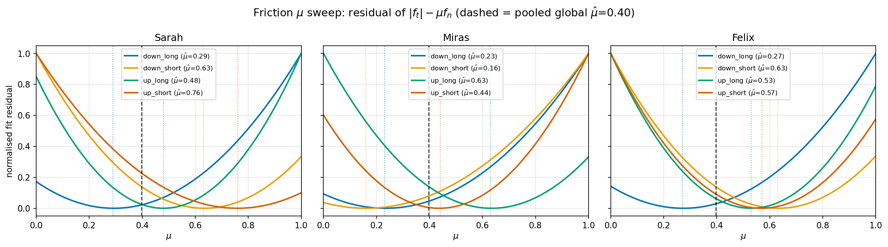

**Effective friction coefficient μ̂.** Normalised residual of `|f_t| - μ f_n` over the
contact phase, swept over μ, per subject and stroke; the minimum of each curve is the
estimate. The firm pressing strokes (`down_long`) agree across subjects at μ̂ ≈ 0.23 to
0.29. Light and return strokes minimise at larger, scattered values, inflated by a
press-independent tangential force (material removal), so μ is read off the firm presses
(μ ≈ 0.25) rather than pooled.

---

## 2. Identifiability analysis: exploration on the 9-DOF task

This section records the identifiability analysis we explored beyond the box-slide
testbed, on the full 9-DOF scraping task. We keep it here because, unlike the toy, the
analysis is not yet quantitatively trustworthy on the re-sliced models (see the
feasibility caveat at the end); the value is the structure of the problem and the
methods, which motivate the future-work framework.

**Whole-stroke feature Jacobian.** Applied to the 9-DOF OCP with the fully per-joint-split
library (18 features), the whole-stroke `H`, features integrated over the entire
trajectory, is rank-deficient, with the per-segment torque terms collinear; this is what
motivates the pruned library (energy split per joint but torque collapsed to three groups).

**What a single spectrum conflates.** A single SVD of the integrated features cannot, on
its own, say why a direction is soft, because each feature is a time integral
`φ_i = Σ_t φ_i(z_t)` and the marginal sums the time axis away. Two features collapse into
one small singular value for two different reasons. They may be pointwise collinear,
`φ_a(t) ∝ φ_b(t)` at every instant, a genuine redundancy that survives in any sub-window
(the per-segment torques). Or they may align only after integration: different time
support or opposite trends whose stroke totals happen to match. The latter is
phase-dependent. A clear instance is the joint-acceleration feature, whose value is
concentrated at the stroke ends and near-zero through the constant-velocity middle, so its
weight is identifiable at the ends and structurally unidentifiable mid-stroke:
identifiability that is genuinely a function of time.

**Time-resolved sensitivity.** Restricting the feature sum to a window `W` gives a windowed
Jacobian `H^W` from the same re-solves, with `Σ_W H^W = H`, turning the single smallest
singular value into a profile `σ_min(t)`. This separates pointwise (every-window)
redundancies from integration artifacts, at no extra solve cost.

**Two axes, and the posterior.** The KKT spectrum is local in weight (a quadratic at the
operating point) and aggregated in time; a Langevin posterior over the loss
`p(w | demo) ∝ exp(-L(w))` walks the true landscape but, run on a single stroke-constant
weight vector, is equally aggregated in time. For soft directions that survive, the point
estimate is set by the regulariser, not the data, so a posterior (Laplace covariance
`(H^T H)^-1` refined by Langevin sampling) is the honest report: an identified projection
plus a band along the free axes. The missing cell, an estimator both landscape-aware and
time-resolved (a Langevin posterior over `w(t)` with a continuous `σ_min(t)`), is the
future-work framework.

**Feasibility caveat.** These 9-DOF numbers are not yet reportable. After re-slicing the
demonstrations and updating the body models, the CSQP OCP does not currently solve to
feasibility at the analysis operating point: the multiple-shooting dynamics gaps do not
close (the constraints themselves are satisfied), so the feature Jacobian is taken around
a non-stationary point and its rank and conditioning are unreliable. The KKT sensitivity
is only valid at a converged, feasible KKT point; re-establishing feasibility of the
re-sliced OCP is therefore a prerequisite.

---

## 3. Inverse-kinematics fit quality

The joint trajectories that drive the recovery are obtained by inverse kinematics: fitting
the scaled body model to the recorded marker set. The table reports the per-marker RMSE
between the model's forward kinematics at the solved joint angles and the recorded markers,
averaged over the 16 to 17 upper-body markers and over the cycle.

The two takes differ markedly in kinematic precision. The NYU OptiTrack session (13_02)
fits the markers to sub-centimetre accuracy on most strokes (0.2 to 0.7 cm, rising to about
1.3 cm only on the long down-stroke), whereas the Evercoast session (27_02) fits to about 2
to 3.5 cm. The OptiTrack take is the more precise kinematic source; the Evercoast take
trades marker precision for the volumetric contact localisation it adds. More importantly,
the recovered cost agrees across the two takes despite this roughly six-fold difference in
marker-fit residual, so the recovery is not limited by kinematic precision at this level.

**Inverse-kinematics fit residual** (mean per-marker RMSE, cm) by subject, session, and stroke.

| Subject | Session | down long | down short | up long | up short |
|---|---|---|---|---|---|
| S3 | 13_02 | 1.19 | 0.30 | 0.32 | 0.21 |
|       | 27_02 | 2.95 | 2.89 | 3.26 | 3.20 |
| S2 | 13_02 | 1.35 | 0.27 | 0.49 | 0.64 |
|       | 27_02 | 3.22 | 2.87 | 2.70 | 3.46 |
| S1 | 13_02 | 0.37 | 0.54 | 0.50 | 0.70 |
|       | 27_02 | 2.42 | 2.60 | 2.10 | 2.24 |

---

## 4. Full per-stroke recovery results

The long strokes carry the shared-versus-specific comparison; the short strokes are
reported pooled only, as they are not discriminative. The shared-versus-specific ordering
is consistent across both takes: the pooled cost beats the subject-specific cost for the
higher-variability subjects (S3 and S1) on the down-stroke of both takes, and trails
only for the most stereotyped subject (S2). The short strokes are not discriminative:
their contact is confined to a brief mid-stroke window. The force residual is larger than
the kinematic residual relative to its scale, by design: the press-force term is
down-weighted so kinematics drives the selection. Read the force RMSE (newtons) against each
subject's measured mean press: roughly 39 N (S3), 18 N (S2), 10 N (S1).

**Long-stroke held-out recovery, both takes.** Each cell is the held-out mean joint RMSE
(deg) and force RMSE (N), "joint / force", averaged over the five held-out cycles. The
13_02 up-stroke is a segmentation artefact (dagger) and is excluded from the
shared-versus-specific conclusion.

| Stroke | Subject | 27_02 Pooled | 27_02 Specific | 13_02 Pooled | 13_02 Specific |
|---|---|---|---|---|---|
| Long down | S3 | 8.5 / 20 | 11.8 / 28 | 9.5 / 3 | 12.2 / 12 |
|           | S2 | 5.1 / 6  | 4.4 / 9   | 2.2 / 2 | 6.2 / 10 |
|           | S1 | 3.4 / 7  | 3.9 / 8   | 7.0 / 7 | 7.8 / 7 |
| Long up   | S3 | 11.7 / 2 | 17.8 / 11 | 19.1 / 6 † | 19.1 / 6 † |
|           | S2 | 2.5 / 2  | 2.1 / 2   | 26.3 / 3 † | 14.5 / 3 † |
|           | S1 | 1.8 / 2  | 2.2 / 2   | 2.8 / 4  | 2.8 / 6 |

† Segmentation artefact on the 13_02 take (cost collapses onto the task-progress term);
excluded from the shared-versus-specific conclusion.

**Short-stroke held-out recovery, both takes** (pooled cost only). Held-out mean joint
RMSE (deg) / force RMSE (N). The short strokes are not discriminative.

| Stroke | Subject | 27_02 | 13_02 |
|---|---|---|---|
| Short down | S3 | 3.4 / 15 | 2.0 / 3 |
|            | S2 | 0.6 / 19 | 0.1 / 4 |
|            | S1 | 1.3 / 4  | 0.8 / 3 |
| Short up   | S3 | 4.6 / 3  | 8.0 / 14 |
|            | S2 | 0.2 / 2  | 1.6 / 9 |
|            | S1 | 0.4 / 6  | 1.0 / 6 |

---

## 5. Per-joint fits and cost decompositions

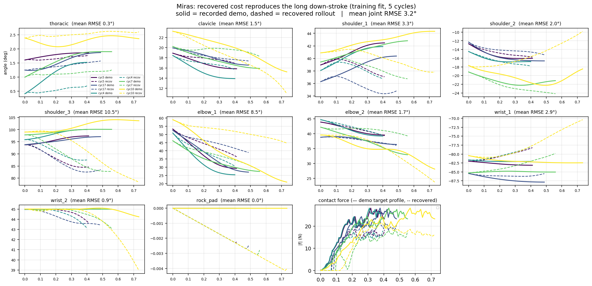

**Training fit on the long down-stroke**, representative subject (S2), all nine actuated
joints plus the contact force. Solid: recorded demonstration; dashed: rollout under the
recovered shared cost.

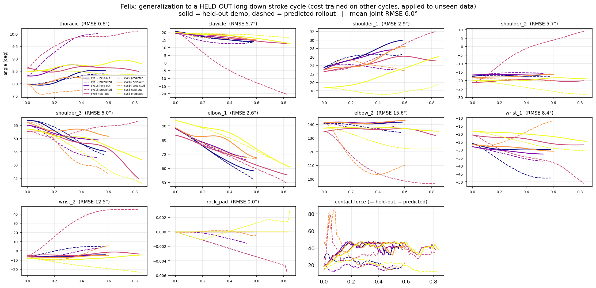

**Held-out generalization, full per-joint view** (S3). The shared cost, trained on
S3's other cycles, applied to his five held-out cycles (solid: demonstration, dashed:
prediction), all nine joints plus force.

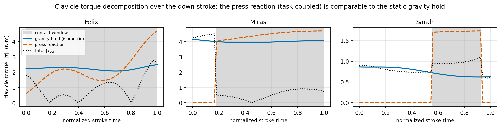

**Clavicle torque decomposition over the down-stroke.** The clavicle actuation torque split
into its static gravity-hold and press-reaction components (the inertial part is negligible);
the press magnitude is the subject's measured mean press, applied over the contact window.
The press reaction is comparable to the gravity hold and is confined to the contact phase,
so the clavicle load is task-coupled, not a static offset.

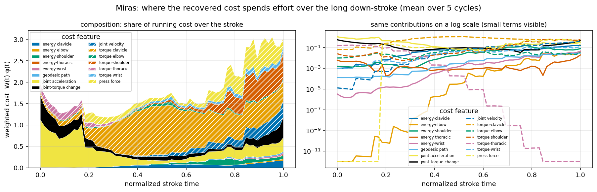

**Running-cost composition** `w(t) · φ(t)` over the down-stroke (representative subject).
Left: share of the running cost by feature over normalised stroke time; right: the same on a
log scale. Proximal torque (clavicle, shoulder) and joint acceleration dominate, with press
force scaling by subject.

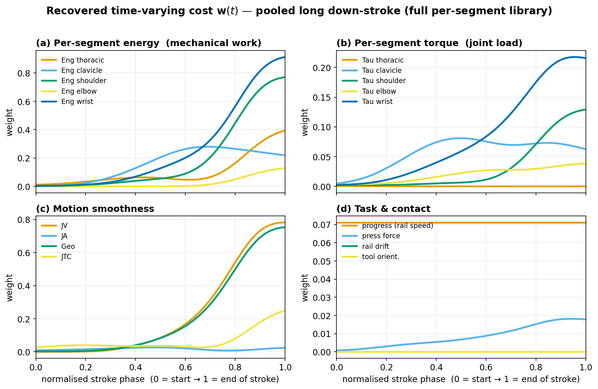

**Raw recovered weights `w(t)` over the long down-stroke**, fitted jointly across the three
subjects (Gaussian basis, K = 12, time-normalised, full per-segment library): (a) per-segment
mechanical work, (b) per-segment joint torque, (c) smoothness terms, (d) task and contact.
Every feature is near-zero through the free approach and rises over the second half: this
shared contact-onset envelope is what the main-text composition figure divides out.

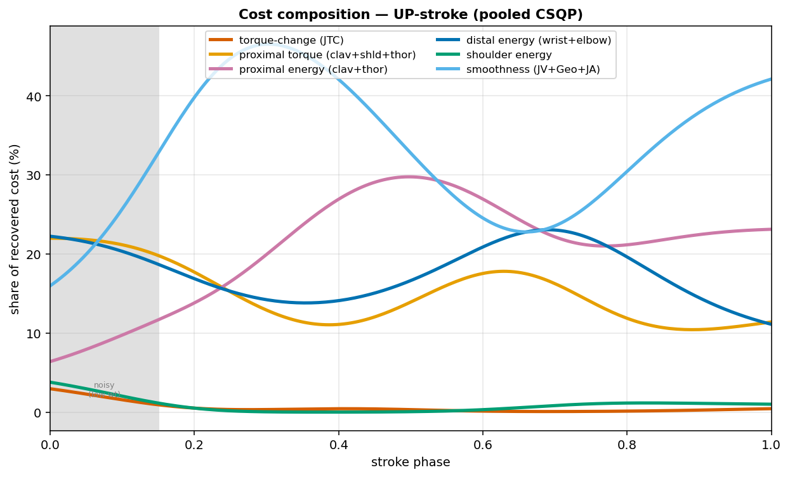

**Cost composition over the up-stroke** (pooled fit, envelope divided out). The up-stroke is
qualitatively different: torque-change (jerk control) is essentially absent, and the profile
is smoothness-bracketed, with a single mid-stroke proximal-energy press between. Its
early/late composition correlation is +0.44 (vs. -0.10 on the down-stroke), a more
time-symmetric objective.

---

## 6. Basis order and weight parametrization

We validate the choice of weight parametrization on the long down-stroke (S2,
five-train / five-held-out), sweeping the basis order `K` and the windowed alternative.
Three findings emerge.

**Accuracy is insensitive to basis order.** Held-out joint RMSE is flat across basis `K`
from 2 to per-step (4.2 to 4.4°): no underfit at K = 2, no overfit at per-step. The recovered
cost for this sustained-contact stroke is essentially time-constant, so there is no temporal
structure for a higher-order basis to capture or overfit.

**Conditioning, not accuracy, distinguishes the basis order.** A low-order basis is
well-conditioned: K = 12 recovers identically with or without the ridge. The per-step basis
is gradient-starved without regularisation, its training error rising to 5.4° (from 4.3°)
when the ridge is removed. This is why we use a low-order Gaussian basis with a gentle ridge
rather than per-step weights.

**Windowed underperforms the smooth basis.** The piecewise-constant windowed parametrisation
is consistently worse, and at `n_w = 12` is the only condition with a train-to-held-out gap
(4.7 to 5.0°): the noisy-staircase degeneracy, where adjacent windows are independent
parameters, so a fine windowing starves each window's gradient and shares no information
across the stroke.

**Basis order and parametrisation** on the long down-stroke (S2), train and held-out joint
RMSE (deg).

| Parametrisation | train | held-out |
|---|---|---|
| basis K = 2      | 4.24 | 4.32 |
| basis K = 6      | 4.43 | 4.26 |
| basis K = 12     | 4.47 | 4.38 |
| basis K = 24     | 4.69 | 4.28 |
| basis per-step   | 4.31 | 4.24 |
| windowed n_w = 2 | 4.97 | 4.63 |
| windowed n_w = 12| 4.72 | 4.95 |
| *ridge removed, basis K = 12*     | 4.42 | 4.34 |
| *ridge removed, basis per-step*   | 5.41 | 4.72 |

---

## 7. Sampling-solver challenger ablation: one challenger versus all K

The sampling inner solver forms its contrastive partition from a single challenger, the MPPI
optimum under the current weights. Because MPPI already evaluates `K` rollout samples per
solve, a natural question is whether using all `K` samples as challengers sharpens the
partition. We tested this on the box-slide, where the planted weight makes recovery directly
measurable as `cos(w*, ŵ)`.

It does not help: across three demonstration regimes the difference is within ±0.012 cosine
with no consistent direction, while the two well-conditioned cases add substantial wall-clock.
The MPPI optimum is the softmax-weighted mean of the samples and is already the strongest
single contrast against the demonstration; the max-entropy partition weights each challenger
by `exp(-w^T φ)`, which drives the many higher-cost samples to negligible weight. We keep the
single-optimum challenger as the default.

**Sample-challenger ablation on the box-slide** (recovery = `cos(w*, ŵ)`, higher is better;
K = 96 fixed samples, 25 IRL iterations).

| demo | single optimum | all K samples | Δ |
|---|---|---|---|
| mixed | 0.953 | 0.943 | -0.010 |
| press | 0.647 | 0.646 | -0.001 |
| glide | 0.889 | 0.900 | +0.012 |

---

## 8. What a recovered weight represents

The two solvers differ not only in how they recover a cost but in what a recovered weight is.
The constrained solver returns the cost whose exact optimum is the demonstration: the recovery
is meaningful only where the inner OCP converges (we gate on the KKT residual rather than the
feasibility flag), but once converged it is a property of the cost and the dynamics alone,
independent of solver settings. Consistent with this, the recovered down-stroke cost is
near-constant across basis orders and with or without the ridge.

The sampling solver instead returns the cost whose MPPI-approximate optimum (a softmax over
rollouts drawn from a finite-horizon, noise-shaped proposal) reproduces the demonstration;
this is meaningful only relative to that sampler's parameters (horizon, sample count,
exploration noise, temperature), and would shift were they changed. Consistent with this,
recovery degrades as soon as the sampling is perturbed: re-seeding the RNG alone drops the
rollout repeatability from bit-identical to 0.74. The two recoveries are therefore
representable in different senses, one absolute (contingent on convergence), the other
relative to a fixed sampler.

---

## 9. CSQP recovery rundown (the IRL descent)

The MO-IRL loop recovers the cost by contrasting the demonstration against a challenger
rollout and updating the weights over iterations. This is the recovery for the pooled long
down-stroke, from the exact-gradient (analytic contact-aware residual) solve.

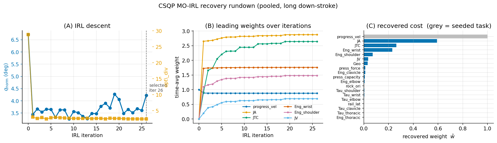

**(A)** the joint error q_norm drops from 6.7 to about 3.4 in the first update and the
feature divergence opt_div collapses with it, after which the Pareto line search trades along
the flat valley (the selected iterate is marked). **(B)** the leading recovered weights climb
and settle over the iterations: joint smoothness (JA) and torque change (JTC) lead, with
proximal mechanical work (Eng at the wrist and shoulder) following. **(C)** the final
recovered weights, with the seeded task features greyed. Read as raw weights the cost is
smoothness plus proximal energy; the proximal-torque load that the paper highlights is read
from the running-cost contribution (the composition figures in section 5), since a raw
weight is a coordinate in a partly unidentified basis.

Regenerate with `experiments/rerun_csqp_downlong.sh` (the recovery, pooled and per subject)
and `experiments/plot_gradient_rundown.py <population_recovery.npz> <out.png>` (the figure).
The per-subject rundowns land in the same folder when the recovery script runs.

---

## 10. Force recovery and cost-strategy figures

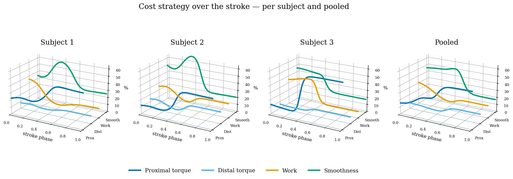

**The recovered cost is a shared time-varying strategy.** Per-instant composition of the
running cost (share of each feature family) over the stroke, for the three subjects and the
pooled cost (long down-stroke, free-force recovery). All four follow the same temporal
hand-off: joint-smoothness peaks mid-stroke, mechanical work rises and fades with the press,
and proximal torque steps up around phase 0.4 to 0.5. Only the emphasis differs by subject.

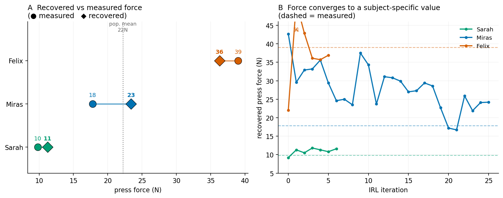

**Recovered vs. measured press force per subject** (cold-IK training). The per-subject cost
reproduces the measured force within a few newtons and preserves the ordering (S1 < S2
< S3), S2 slightly over; the shared population cost compromises to a common about 24 N.
The force is weakly identified: its level follows from the reconstructed, force-loaded
demonstration, while the effort/smoothness backbone is what is robustly recovered.

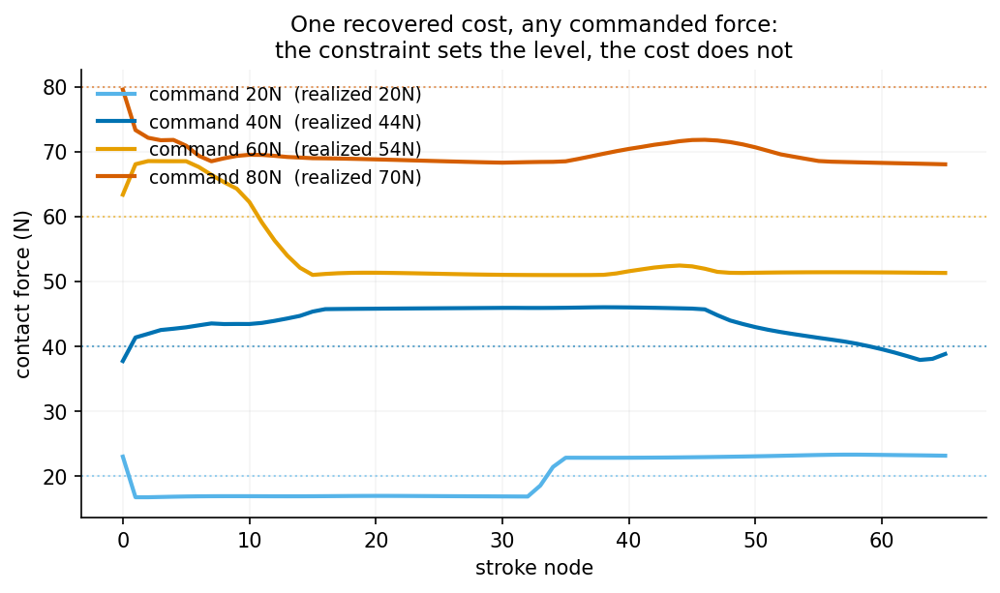

**One recovered cost, any commanded force.** The same recovered cost, re-solved under a
constraint that commands 20/40/60/80 N, produces a valid scrape that tracks each level.
Nothing in the cost selects the absolute force: it is a free scale, resolved only by the
measured value.

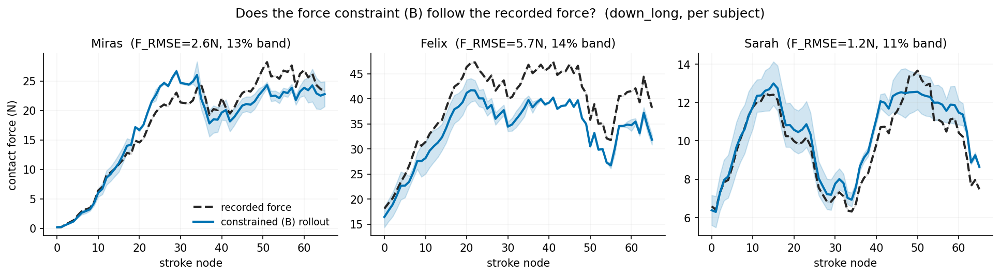

**The supplied-force constraint follows the recorded force.** Per subject, the constrained
(supplied-force) rollout tracks the measured contact-force profile over the stroke to 1 to 6 N
(profile correlation 0.88 to 0.99). Pinning the force this way reproduces the measured profile
but freezes the collinear proximal-torque signal, shifting the recovered cost toward smoothness.

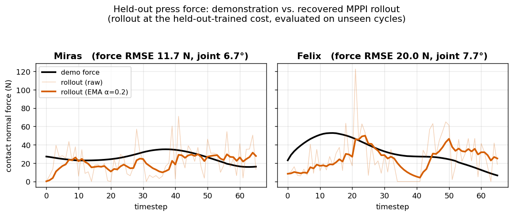

**Held-out press force: demonstration vs. recovered MPPI rollout.** The held-out-trained cost
is rolled out on an unseen cycle; the rollout force (raw faint, EMA-smoothed bold) tracks the
demonstrated force in level and coarse profile but underestimates the peak (S3). The
contact force is recovered as a presence/level, not a precisely regulated magnitude.
