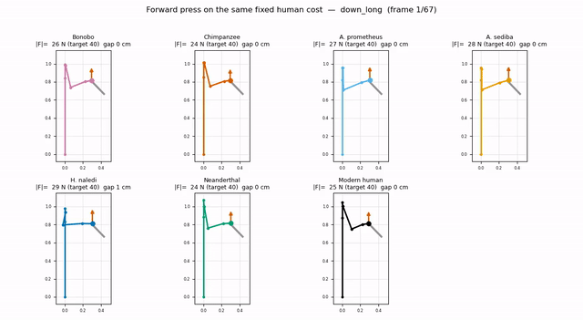
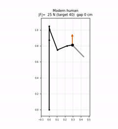
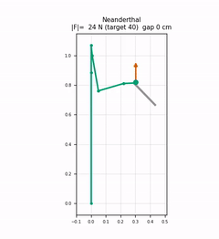
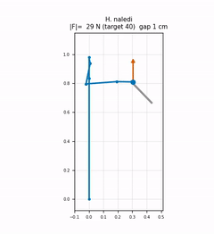
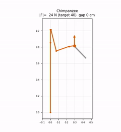
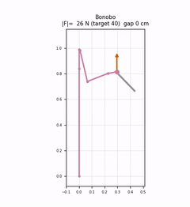
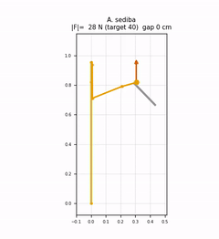
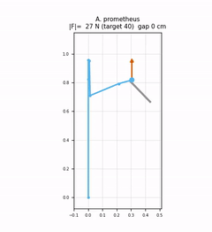
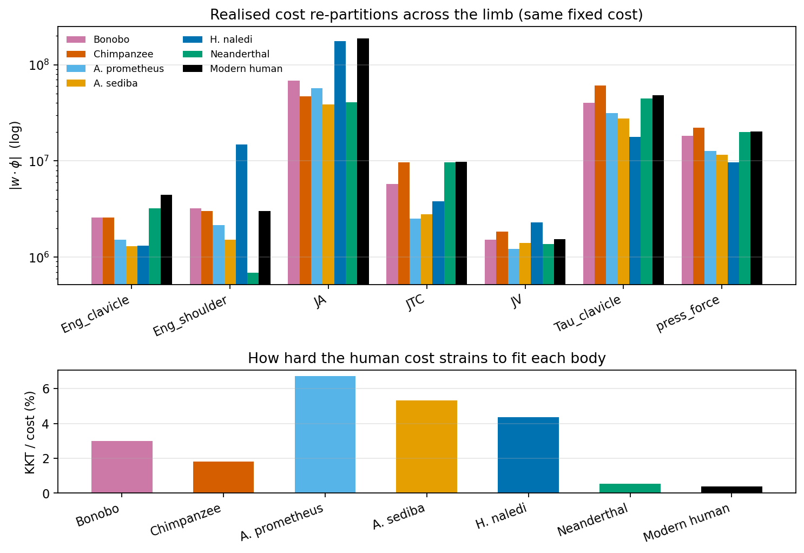
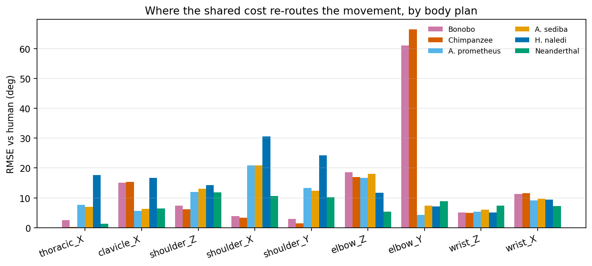

# Cross-morphology analysis of Paleolithic tool use

> The methodology pages recover a cost function from *one* body (a modern human
> subject). This second thread asks a different question: **hold that human cost
> fixed and re-solve the same shaving task on other hominin bodies.** Any
> divergence in behaviour is then attributable to *morphology alone*. Full
> details in the
> [morphology paper](https://github.com/Anastasija42/tool_handling/blob/master/papers/morphology_paper.tex).

  <a href="{{ site.baseurl }}/species_inspector.html"><b>▶ Open the interactive inspector</b></a> 
  <em>seven bodies on both strokes, the recorded demonstration, and the cost comparison —
  rotate, scrub the stroke, ghost one cost over another</em>

<em>The same human-recovered cost re-solved on seven body plans
(human, Neanderthal, <em>H. naledi</em>, <em>A. sediba</em>, <em>A. prometheus</em>,
chimpanzee, bonobo) for the long down-stroke. Identical preferences, different bodies —
the motion diverges by morphology.</em>

## Why a task-level comparison

Stone-tool behaviour is older than our genus and far older than our body: the
earliest flaked artefacts (~3.3 Ma) precede the first *Homo* fossils. Tool-making
therefore spans a broad arc of upper-limb evolution — from an ape-like limb
retained for arboreal support to the dexterity- and force-specialised limbs of
*H. sapiens* and the Neanderthals. The recurring theme is **mosaic evolution**:
capabilities are acquired piecemeal, so a body can have a tool-capable *hand*
while the rest of the limb still carries the mechanical signature of climbing.

This is exactly why comparative anatomy alone is not enough. Knowing a hand
*could* grip a tool says little about whether the whole limb could *execute* a
given task at acceptable cost — the binding constraint may lie proximal to the
hand, in reach, leverage, or the ability to stabilize a contact. A task-level
biomechanical comparison exposes that constraint.

## Shaving: a sustained-contact task

Most of what is known about Paleolithic motor behaviour concerns **knapping** —
the percussive detachment of flakes by a struck hammerstone. Mechanically,
knapping is a brief ballistic impulse that many upper-limb configurations can
meet.

The task we model is different. **Shaving** (scraping / planing — here, smoothing
wood) is a *sustained-contact* act: the tool is pressed against the workpiece
with a controlled normal force while translated along a directed path,
maintaining contact across the whole stroke. It imposes — simultaneously —
adequate reach to the working point *and* stabilisation of a non-trivial contact
force at a distal frame. Fewer body plans can sustain it cleanly, and the *ways*
a body fails (over-reaching, losing contact mid-stroke, spiking the force) are
precisely what make it diagnostic of morphology. The choice is grounded in
comparative anatomy: the Neanderthal forearm in particular has been interpreted
as adapted to forceful, sustained manipulation (hide-scraping, woodworking)
rather than to throwing.

## Known capabilities of each morphology

A single compact axis — the **brachial index** (radius / humerus × 100) —
organises much of the variation and carries direct mechanical meaning: a long
forearm (high index) lengthens both the effort lever and the reach envelope but
raises the inertia that must be accelerated and the torque needed to stabilise a
distal contact force. Modern humans and Neanderthals share a *low* index
($\approx 74$); living apes and the australopiths carry a *high* index
($\approx 83$–$90$), a primitive retention associated with arboreal competence;
and *H. naledi* and *A. sediba* sit at or just below the australopith range while
showing derived, *Homo*-like features elsewhere in the limb and hand.

- **Modern human** — the reference for high dexterity in this study.
- **Neanderthal** — accomplished toolmakers with arms tuned for *forceful,
  sustained* manipulation rather than throwing. Flexion/rotation muscles are
  estimated **33–45 % stronger** than modern humans'; an anteriorly oriented
  trochlear notch and long olecranon favour forceful loading at a partly-flexed
  elbow, while a small deltoid tuberosity and modest retroversion argue against
  habitual throwing.
- **_H. naledi_** — a tool-using hand signature (long robust thumb,
  human/Neanderthal-like wrist) alongside strongly curved, climbing-loaded
  fingers, on a small (500–560 cc) brain. The diagnostic upper-limb trait is
  **low humeral torsion (~91° vs ~140° in modern humans)**, which reorients the
  elbow medially.
- **_Pan troglodytes_ & _Pan paniscus_** (chimp, bonobo) — closest living
  relatives and the lower bracket of lithic capability: habitual percussive
  (nut-cracking) tool users; trained bonobos detach crude flakes. Ample strength,
  but a long high-inertia humerus and a knuckle-walking wrist with a **restricted
  dorsiflexion ceiling (~20°)** — tuned for climbing, not a controlled shave.
- **_A. sediba_ (MH2)** — an early *transitional* manipulative grade: long thumb +
  short precision-grip fingers, with a strong climbing flexor apparatus, on a body
  statistically distinct from both apes and humans (**BI ≈ 84**). A clean test of
  whether *limb mechanics* rather than the hand are the binding constraint.
- **_A. prometheus_ (StW 573 / "Little Foot")** — the most complete australopith
  known; an **ancestral pre-tool baseline**. Arboreally configured upper limb with
  **very low humeral torsion (~120°)**, ape-intermediate proportions (**BI ≈ 83**),
  on a small body (**27–32 kg**).

## The hypothesis, made quantitative

Two bodies pursuing the *identical* motor goal under the *identical* cost
function need not move identically: the optimal control problem is re-shaped by
each body's segment lengths, joint orientations, ranges of motion and inertias.
We hold a single human-recovered cost fixed and re-solve the same contact-rich
shaving OCP on each morphology, turning qualitative "form implies function"
statements into quantitative, task-specific predictions — and exposing where a
body simply *cannot* realise the human strategy.

## Modeling: one base, generated programmatically

All body plans share a single articulated base — a **36-DOF ISB upper-body
model** whose human instance is scaled to the motion-capture subject — so
differences between taxa arise from morphology, not from incidental modelling
choices. The non-human models are **generated programmatically** from the human
base (`morphologies_study/generate_species_urdf.py`) rather than edited by hand.
One routine rescales each segment from its measured bone length (so the
*forearm* as well as the humerus is differentiated and the **brachial index** is
reproduced), scales the axial skeleton by body size, encodes humeral torsion and
glenoid orientation, sets segment mass/inertia, and sets joint range-of-motion,
velocity, and effort limits.

The channels enter the OCP at different points:

| Channel | Enters the OCP as |
|---------|-------------------|
| Segment geometry, joint orientation | kinematics |
| Mass, inertia | dynamics |
| Position & velocity limits | hard state bounds on the trajectory |
| Actuation effort | hard per-joint torque ceilings (box constraints), scaled per taxon |

Each value is **graded by evidence** so the reader can see how much of a body
plan is data vs. assumption:

- **M** — measured/published for the taxon
- **E** — estimated or scaled (e.g. fossil masses scaled by body mass; effort by
  physiological cross-sectional area $\propto$ body-mass$^{2/3}$)
- **H** — no taxon-specific datum; the modern-human value is retained

Where the literature is firm it dominates the model: the *Pan* knuckle-walking
wrist caps dorsiflexion at ~20°, and chimpanzee actuation is scaled to its
measured dynamic muscle capacity. The full parameter compilation (lengths,
torsion, ROM, mass, muscle capacity, all with evidence grades and sources) is in
the morphology paper appendix.

## Task and workpiece placement

A workpiece fixed at one world location would be unfair — a short-limbed body
would simply fail to reach a stick positioned for a tall one, confounding "cannot
reach" with "cannot perform". We instead transfer the human's *demonstrated*
working configuration to each body in a scale- and orientation-normalised way.
From the human cycle we read, at the contact phase, the tool-contact point
relative to the shoulder in the trunk frame, recording its direction $\hat d$ and
its distance as a **fraction $r$ of the human's arm reach** $L^H$. Each species
$s$ receives the workpiece at the same trunk-relative direction and the same
fraction of *its own* reach:

$$p^s_{\text{tool}} \;=\; p^s_{\text{sh}} \;+\; r\,L^s\,\bigl(R_{T^s}\,\hat d\bigr).$$

Held fixed across morphologies: the working **direction** relative to the trunk,
the **reach fraction**, the press orientation, and the absolute commanded normal
force. Deliberately *not* fixed — absolute position and distance — is exactly
what would otherwise trivialise the comparison. Any residual reach gap, loss of
contact, elevated force, or compensatory joint excursion is therefore a genuine
consequence of morphology.

## The bodies

All seven body plans are instantiated as articulated models and run through the
forward transfer (humerus/radius from published specimens; brachial index
= 100 × radius/humerus):

| Taxon | Humerus / Radius (mm) | Brachial index | Humeral torsion | Notes |
|-------|----------------------|----------------|-----------------|-------|
| **Modern human** (*H. sapiens*) | 311 / 230 | 74 | ~142° | reference (cost recovered here) |
| **Neanderthal** | 304 / 224 | 74 | ~137° | short robust forearm, tuned for force |
| ***H. naledi*** | 256 / — | — | ~91° | low humeral torsion, tool-capable hand |
| **Chimpanzee** (*P. troglodytes*) | 302 / 270 | 89 | ~150° | long high-inertia humerus, restricted wrist (~20° dorsiflexion) |
| *Bonobo* (*P. paniscus*) | 283 / 256 | 90 | ~140° | lower bracket of lithic capability |
| *A. sediba* (MH2) | 269 / 226 | 84 | ~117° | transitional; precision-capable hand |
| *A. prometheus* (StW 573) | 290 / 240 | 83 | ~120° | ancestral pre-tool baseline |

## Static arm-hold test

As a fast probe before the full contact optimisation, each body is placed at its
own allometric workpiece station by inverse kinematics and held against gravity.
Because the station is set *per body*, every morphology reaches it (residual
< 1 mm), so the comparison is about the **cost and posture of the hold**, not
reach.

| Taxon | ‖τ‖ (Nm) | Στ/τ_max | Shoulder excursion (°) |
|-------|---------|----------|------------------------|
| Modern human | 8.1 | 0.15 | 14 |
| Neanderthal | 9.1 | 0.14 | 27 |
| *H. naledi* | 3.2 | 0.11 | **52** |
| *A. sediba* | 3.1 | 0.12 | 37 |
| *A. prometheus* (StW 573) | 3.2 | 0.11 | 34 |
| Chimpanzee | 9.4 | 0.15 | 20 |
| Bonobo | 6.3 | 0.12 | 21 |

Two signals already separate the taxa. **Absolute holding effort** tracks arm
mass and length — the long, heavy-limbed chimpanzee and Neanderthal need the most
torque (~9 Nm), the small light-limbed australopiths the least (~3 Nm). More
diagnostic, the **shoulder excursion** needed to bring the hand to the
human-style station rises sharply in the low-torsion taxa: *H. naledi* must
rotate its shoulder ~52° (vs ~14° for the human) to point its medially-rotated
elbow at the workpiece. Relative to each body's own strength the hold is modest
for all (Στ/τ_max ≤ 0.15) — a static press is *not* strength-limited; the
morphological cost surfaces as **posture** here, and dynamically as
contact-force sustainability in the full task.

## Predictions

With the reward fixed, behaviour should diverge by body:

- **Neanderthal** — short, robust, heavily-muscled forearm built for force: the
  human strategy should transfer at *lower kinematic cost* but *higher, more
  sustainable contact force*; cost dominated by force consistency over peak speed.
- **_H. naledi_** — low humeral torsion rotates the elbow medially, so
  reproducing the human tool-axis demands large compensatory shoulder/elbow
  excursions and a tendency to over-reach the shared workpiece — favouring
  shorter, higher-frequency strokes over sustained high-pressure presses.
- **Chimpanzee** — long high-inertia humerus and restricted wrist: a contracted
  tool-axis cone and elevated effort for sustained manipulation — explosive
  capacity, poor fit to a steady press (highest peak contact force of the set).
- **Australopiths** (*A. sediba*, StW 573) — high brachial index lengthens reach
  but raises distal stabilisation torque: they can *reach* the workpiece yet incur
  a reach-and-stabilise penalty; for *sediba*, whose hand is precision-capable,
  the limiting factor is *proximal limb mechanics rather than the hand*.

## A single shared cost

Every behavioural result below uses **one** cost function, recovered once from the
human demonstrations of the down-long stroke by population MO-IRL and then held
fixed across every body. It is a *time-varying* weight field $W(t)$ expressed in a
Gaussian basis over the normalised stroke. By realised **cost contribution**, the
down-stroke is led by:

- **Effort** — per-segment joint torque + mechanical energy: **~50 %**
- **Smoothness** — joint acceleration + torque-change: **~35 %**
- **Contact** — holding the hand on the workpiece at the demonstrated **~40 N**: **~10 %**

No weight is re-tuned per taxon — every divergence reported below is the
morphology answering the *same* reward.

**Reading the recovered cost.** Two facts guard against misreading the weights.
First, features are put on a common scale before recovery (each normalised by its
spread), so a raw weight is *not* itself a measure of importance: the **geodesic**
term carries one of the *largest* weights yet contributes almost nothing to the
realised cost, whereas **joint acceleration** carries a near-*zero* weight but one
of the largest contributions. The quantity we interpret is the realised
contribution $|w(t)\cdot\phi(t)|$. Second, several effort features (per-joint
torque, mechanical energy, joint velocity) rise and fall together, so the
*division* of cost among them is only weakly pinned down even where their
*aggregate* is well determined — see [Identifiability](identifiability). We
therefore interpret the cost at the level of three coherent groups — **effort,
smoothness, contact** — not a precise per-feature ranking.

## Results: morphology-appropriate behaviour

Holding the single human-recovered cost fixed (population recovery from the long
down-stroke, press-force target ≈ 40 N) and re-solving the shaving OCP on each
body confirms the predictions. Two views are reported.

### On each body's own allometric station — *where* the mismatch goes

With reward fixed, behaviour diverges *anatomically* rather than uniformly — and
how sharply depends on whether each body stations its *own* workpiece or must
reach the *human's*. The optimal-control problem is solved to convergence for
every taxon (all reach **< 3 % relative residual**), so the residual no longer
separates the bodies; morphological distance is instead read off two channels:
per-joint kinematic divergence and the realised cost decomposition.

<em>Left to right: Neanderthal (tracks the human at every joint),
chimpanzee (absorbs the mismatch at the elbow), <em>H. naledi</em> (re-routes
through the shoulder girdle).</em>

**Own (allometric) station — divergence is _diffuse_.** Free to place its own
work, every plan re-routes broadly, **30–36°** across the clavicle, shoulder and
elbow. Here the long-armed apes pay an *enormous* cost: the chimpanzee's shoulder
energy, torque-change and joint-acceleration each exceed the human's by **one to
two orders of magnitude** — explosive effort against its own workpiece.

**Shared (human) workpiece — divergence _localises_.** Forcing all seven onto the
same world workpiece removes that freedom and concentrates the re-routing on the
joint each body is least able to adapt:

| Taxon | Where it re-routes | Magnitude |
|-------|--------------------|-----------|
| **Neanderthal** | tracks the human at every joint | **10.6° overall RMSE** |
| **Chimpanzee** | elbow (knuckle-walk cap + long forearm) | **elbow-Y 42° RMSE** |
| **Bonobo** | elbow (same as chimp) | **elbow-Y 43° RMSE** |
| ***H. naledi*** | shoulder girdle (low torsion) | **shoulder-Y 25°, shoulder-X 19°, shoulder-Z 16°** |
| **Australopiths** | between apes and humans | intermediate |

The *shape* is as diagnostic as the size: the apes hold **elbow-Y almost fixed
near 80°** for the whole stroke while the human sweeps it from **137° → 112°**,
riding high at the clavicle; *H. naledi* carries its shoulder girdle off the
human's throughout — ~30° higher in shoulder-Y, starting ~25° lower in shoulder-X.
Overall per-joint kinematic divergence under the shared workpiece is ~**10°** for
the Neanderthal and australopiths, **14°** for *H. naledi* (routed almost entirely
through the shoulder girdle), and **16–18°** for the long-armed apes.

<em>The two channels morphological distance is read from: realised
cost decomposition (left) and per-joint kinematic divergence (right).</em>

### On a single shared world stick — reach and contact sustainability

When *one* world-fixed stick is presented to every body (deliberately unfair),
the morphological limits surface as a reach gap and an over/under-press. The reach
deficit orders the taxa by limb length and torsion:

| Taxon | Reach gap (m) | Peak contact force (N) | Reading |
|-------|--------------|------------------------|---------|
| Modern human | 0.00 | ~40 | reference |
| Chimpanzee | 0.07 | ~43–48 | reaches easily, but **overshoots the press** |
| Bonobo | 0.08 | ~43–48 | highest peak force of the set |
| *A. sediba* | ~0.20 | ~40 | reaches with a stabilisation penalty |
| Neanderthal | ~0.20 | ~40 | tracks the human force cleanly |
| *A. prometheus* | ~0.20 | ~40 | ancestral baseline |
| ***H. naledi*** | **0.30** | **38 (dips mid-stroke)** | **furthest short, weakest & least-sustained press** |

The human cost is thus *not* morphology-neutral: identical preferences imply
different — and on the shared stick sometimes barely feasible — behaviour on a
different body. *H. naledi* falls furthest short and simultaneously sustains the
**weakest press (peak 38 N, dipping mid-stroke)** — the poorest contact
sustainability of the set; its short humerus and low torsion deny it both reach and
a bracing posture. The long-armed apes reach most easily and press slightly
*above* the 40 N command, their explosive press surfacing only on their own
workpiece.

> Numbers from `analysis/special/pop_downlong/forward_transfer/` (allometric
> station, cost residual + per-joint divergence) and `…/forward_fixedstick/`
> (shared stick, reach gap + peak force), down_long, geometry subject S3.

## Up-stroke vs down-stroke

Applying the same recover-then-transfer procedure to the **up-stroke** (the
lighter return, demonstrated at ~30 N) separates *which* morphological departures
are force-driven and which are geometry-driven. The two strokes carry
qualitatively different costs:

| | Effort + contact | Smoothness | Press-force term |
|---|---|---|---|
| **Down-stroke** (working scrape) | torque + energy **55 %** | — | **14 %** |
| **Up-stroke** (return) | — | joint accel + jerk **78 %** | **1 %** |

Because the up-stroke is light and smooth, every body reproduces it far more
closely — per-joint divergence falls by a **factor of 2–3** (Neanderthal
**22° → 6°**, chimpanzee **33° → 10°**). The exception is diagnostic: ***H.
naledi*'s divergence barely falls (26° → 19°)** and it becomes the **most
divergent body on the up-stroke**, overtaking the apes.

- The apes' large down-stroke divergence is therefore **effort-driven** — a
  property of the heavy press that recedes when the press does.
- *H. naledi*'s divergence is **geometry-driven** — its low humeral torsion
  re-routes the limb at the shoulder and elbow *whatever* the contact force.

Return-stroke figures are in `analysis/special/` and the
[morphology paper](https://github.com/Anastasija42/tool_handling/blob/master/papers/morphology_paper.tex)
up-stroke appendix.

## A two-axis morphospace

The whole comparison compresses into two PCA maps of the seven bodies, with the
modern human fixed at the origin — distance from the human = how *unlike* the
human a body is, in two different currencies:

- **Cost-contribution space (tactic)** — position set by *how* a body spends the
  fixed cost across features. Two bodies sit close when they *pay for* the
  movement the same way.
- **Kinematic space (movement)** — position set by the per-joint trajectory. Two
  bodies sit close when they *move* the same way.

Reading them together is informative because a body can be unlike the human in one
currency but not the other:

- **Neanderthal** — pays the cost most like the human → closest in the **cost** map.
- **Australopiths** — move most like the human → closest in the **kinematic** map,
  while spending the cost somewhat differently.
- **Long-armed apes** — move about as unlike the human as the Neanderthal does,
  yet pay the cost *far* more differently: the signature of reaching a similar
  motion through **explosive effort** rather than a different path.
- ***H. naledi*** — the only body far from the human in **both** maps: divergent in
  how it moves *and* in how it pays. The most distinctive plan.

## Discussion

The central result: a single human-recovered cost, transferred unchanged, produces
**not uniform degradation but a structured, anatomically localised
re-organisation**. Divergence concentrates at the joint each morphology least
shares with the human — the **elbow** for the long-armed, wrist-capped apes and
the **shoulder girdle** for the low-torsion *H. naledi* — while the Neanderthal,
closest in forearm proportion, tracks the human at every joint. This bears out the
form-driven predictions *from the optimal control directly* rather than by
anatomical analogy: where comparative anatomy says "low torsion rotates the elbow
medially," the transferred cost shows the *shoulder* paying for it in degrees of
compensatory excursion.

The cost-contribution and kinematic channels are **partly independent**: no single
body is closest to the human on both. How far a body sits from the human solution,
and the currency in which it pays that distance, are two separate readings — and
the morphospace is where they are read together. Reach and contact sustainability
add a second, partly orthogonal axis: under a shared stick, limb length and
torsion set who can reach it, with *H. naledi* showing the largest reach gap and
weakest press. This cautions against reading the per-body (re-stationed) results
alone as evidence of capability — a body that moves human-like at its own station
may still be unable to reach or hold the shared tool.

## Generality levels

The recovered cost can be shared at three levels of generality, which the IRL
sweeps evaluate:

- **SDDD** — Subject- and Direction-Dependent (one cost per subject × stroke)
- **SDDI** — Direction-Independent (shared across strokes)
- **SIDI** — Fully Shared (one cost across subjects and directions)

Initial human-subject results show joint-acceleration regularization dominates
within-cycle.

## Limitations

A modelling choice bounds the force results. With **per-joint actuation ceilings
enforced as hard torque constraints**, effort capacity is no longer a soft cost
term alone: a body that would need supra-capacity torque is held at its limit
rather than producing it. What remains *soft* is the **contact force** itself —
governed by a press target in the shared cost rather than pinned — so bodies
overshoot or undershoot it rather than being driven to the much higher peaks a
raised target would demand. Quantifying the "explosive, poorly-sustained" ape
press across higher, demonstration-matched force targets is a targeted extension,
not a reframing.

A more fundamental scope note concerns **the hand**. Our models represent the limb
*to the wrist* and treat the hand–tool coupling as given: the OCP asks where the
*proximal* limb strains, conditional on a hand that can grip and steady the tool.
It does **not** test whether the hand can generate the precision or sustain the
grip force the press demands. For *H. naledi* and *A. sediba* in particular —
tool-capable hands that retain a strong flexor apparatus and curved,
climbing-loaded fingers — the binding constraint could lie in the *hand* rather
than the shoulder excursion we report.

Finally, the **14-feature library is over-parameterised**: effort-related features
(Torque, Energy, Joint Velocity) often explain the same trajectory variance, and
including friction-augmented torque shifts the recovered weight ratios
significantly (friction adds substantial load during contact). This degeneracy —
see the [identifiability analysis](identifiability) — affects the *interpretation*
of the weights more than the transfer itself, since forward divergence depends on
the realised behaviour the cost induces, not the particular feature split.

## Conclusion

We presented a cross-morphology IRL framework that recovers the cost of a
contact-rich shaving task from human motion capture and, holding that cost fixed,
re-solves it on seven hominin upper-limb plans. Because only the body changes,
every behavioural difference is attributable to morphology. The transfer turns
"form implies function" into task-specific, quantitative statements: it
**localises** where each body must deform the human strategy (the ape elbow, the
*naledi* shoulder girdle), and under a shared workpiece **exposes a
reach-versus-contact-stability trade-off** that orders the taxa by limb proportion
and torsion. The **Neanderthal** realises the human shaving strategy most cheaply;
***H. naledi* and the australopiths** pay the largest reach and stabilisation tax,
consistent with a limb still carrying an arboreal-retention signature while the
hand becomes tool-capable. The binding constraint is often **proximal to the
hand** — in reach and contact stabilisation rather than grip. More broadly, the
recover-a-cost-then-transfer-it recipe is agnostic to its application: a
demonstrated gesture and a parameterised body let any field ask what a fixed motor
strategy demands of a body that never performed it.

## Future work

- Replace the rigid-link actuation with a fuller **musculoskeletal model** per
  species.
- Use chimpanzee movement datasets (**ChimpAct**) to estimate the animal's *own*
  contact strategy and transfer *that* — rather than the human's — onto the tasks
  of interest.
- Extend from sustained shaving to **other tasks**, whose different mechanical
  demands should rank the morphologies differently.

## Appendix: upper-limb modelling parameters

Evidence grades: **M** measured/published for the taxon, **E** estimated/scaled
(fossil mass ∝ body mass; effort ∝ physiological cross-sectional area ∝
body-mass$^{2/3}$), **H** no taxon-specific datum — modern-human value retained.
Humeral-torsion convention here: larger = more medially-directed head.

### Long-bone lengths and brachial index

| Taxon | Humerus (mm) | Radius (mm) | BI | Source |
|-------|------:|------:|----:|--------|
| **_H. sapiens_** | 311 | 230 | 74 | Scott Williams |
| **_P. troglodytes_** (chimp) | 302 | 270 | 89 | Scott Williams |
| _P. paniscus_ (bonobo) | 283 | 256 | 90 | Scott Williams |
| _A. prometheus_ (StW 573) | 290 | 240 | 83 | Heaton 2019 |
| _A. sediba_ (MH2) | 269 | 226 | 84 | Holliday 2018 |
| **_H. naledi_** | 256 | — | — | Feuerriegel 2017 |
| **_H. neanderthalensis_** (Eur.) | 304 | 224 | 74 | Churchill 2026 (*n*=7) |

### Joint orientation and range of motion

| Quantity / Taxon | Value | Ev. | Source |
|---|---|:--:|---|
| **Humeral torsion (°)** | | | |
| Modern human | ~142 | M | Larson 1988 |
| Neanderthal | ~137 M / 115 F | E | from retroversion, Churchill 2026 |
| _H. naledi_ | 91.0 (105 juv.) | M | Feuerriegel 2017 |
| _A. sediba_ | 117.0 (MH1 112) | M | Churchill 2013 |
| _A. prometheus_ | 120 | M | Heaton 2019; Crompton 2021 |
| Chimpanzee | 148–153 (high) | M | Larson 1988 |
| **Wrist dorsiflexion ceiling (°)** | | | |
| Chimpanzee / Bonobo | ~14–20 | M | Thompson 2020 |
| Others | def. human (~45–70) | H | no fossil ROM data |

### Body and segment mass

| Quantity / Taxon | Value | Ev. | Source |
|---|---|:--:|---|
| **Body mass (kg)** | | | |
| Modern human | ~65 | M | reference subject |
| Neanderthal | 77 M / 66 F | M | Churchill 2026 |
| _H. naledi_ | 37.4 (CI 34–40.5) | M | Garvin 2017 |
| _A. sediba_ | ~29 (26–36 range) | M | Grabowski 2015; Holliday 2018 |
| _A. prometheus_ | 27–32 | E | Crompton 2021 |
| Chimpanzee | ~50 (47.7 F / 56.0 M) | M | Schoonaert 2007 |
| Bonobo | ~41 | M | Druelle 2018 |
| **Upper-arm / forearm / hand (kg)** | | | |
| Modern human | 1.8 / 1.28 / 0.45 | M | reference model |
| _H. naledi_ | 1.0 / 0.61 / 0.23 | E | de Leva fractions × 38 kg |
| Chimpanzee | 2.1 / 1.5 / 0.7 | M | Schoonaert 2007 |
| Bonobo | 1.39 / 1.03 / 0.60 | M | Druelle 2018; Diogo 2017 |

### Muscle force capacity

| Taxon | Value | Ev. | Source |
|---|---|:--:|---|
| Modern human | reference; specific tension ~14 N cm⁻² | M | reference |
| Neanderthal | forearm flexion +33–45 % | E | Churchill 2026 |
| Chimpanzee | ~1.35× dynamic; ST ≤ human | M | O'Neill 2017 |
| Bonobo | ST 10.7–12.1 N cm⁻² (< human) | M | Degens 2025 |
| _H. naledi_, _sediba_, _prometheus_ | strong flexors (qual.) | M | Kivell 2015; Crompton 2021 |

### Human base joint limits (retained unless overridden)

| Joint | ROM (deg) | Velocity (deg/s) | Effort (Nm) |
|---|---|---|---|
| thoracic_X | −60 .. 60 | 298 | 190 |
| clavicle_X | −20 .. 60 | 802 | 100 |
| shoulder_Z | −180 .. 180 | 1008 | 92 |
| shoulder_X | −60 .. 180 | 344 | 71 |
| shoulder_Y | −90 .. 180 | 344 | 52 |
| elbow_Z | 0 .. 150 | 1140 | 77 |
| elbow_Y | −20 .. 180 | 344 | 15 |
| wrist_Z | −90 .. 90 | 1432 | 100 |
| wrist_X | −45 .. 45 | 344 | 100 |

**Species ROM overrides — chimpanzee & bonobo (knuckle-walking wrist):**
`wrist_Z −60 .. 20` (dorsiflexion capped at 20°), `wrist_X −15 .. 15`,
`elbow_Y −20 .. 80`. Effort and velocity limits are **scaled per taxon** by the
factors below.

### Per-taxon scaling multipliers (`generate_species_urdf.py` `PARAMS`)

| Taxon | Torsion (°)† | Glenoid tilt (°) | Mass (kg) | Torso width | Effort | Forearm effort | Vel |
|---|---:|---:|---:|---:|---:|---:|---:|
| Modern human | 165 | 0 | 65 | 1.00 | 1.00 | 1.00 | 1.00 |
| Neanderthal | 137 | 0 | 77 | 1.19 | 1.25 | 1.40 | 0.80 |
| _H. naledi_ | 91 | 12 | 37 | 0.91 | 0.80 | 1.00 | 1.00 |
| _A. sediba_ | 117 | 12 | 29 | 0.95 | 0.67 | 1.00 | 1.00 |
| _A. prometheus_ | 120 | 12 | 30 | 1.00 | 0.68 | 1.00 | 1.00 |
| Chimpanzee | 153 | 10 | 50 | 1.10 | 1.35 | 1.00 | 1.15 |
| Bonobo | 150 | 10 | 41 | 1.05 | 1.15 | 1.00 | 0.90 |

† These torsion values use the model-generation (S8) convention; the
[The bodies](#the-bodies) table above uses the osteometric convention (human
~142°), so the two differ by a fixed offset rather than contradicting.
*Source: `morphologies_study/generate_species_urdf.py` (`PARAMS`) + human base
joint limits.*

> Code: `morphologies_study/` —
> `generate_species_urdf.py` (programmatic model generation),
> `run_species_forward.py` (re-solve the fixed cost on each body),
> `run_species_inverse.py`, `preview_reachability.py`.

---

[Home](.) | [Method](method) | [Identifiability](identifiability) | [Results](results) | [Gallery](gallery) | [Code](code)
