# Motion previews

Auto-generated GIFs of one cycle per subject × source × task.
`27_02_sensor` is the `trajectories_from_mocap_sensor/` folder (despite the name, these are the *without-sensor* takes).
Regenerate with `python docs/scripts/gen_motion_gifs.py`.

## S3

| Task | 13_02 | 27_02_sensor | 27_02 |
|------|-------|-------|-------|
| **down_long** | 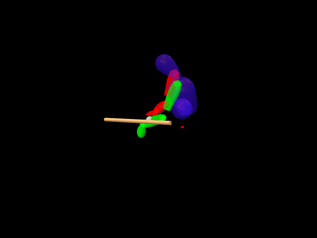 | 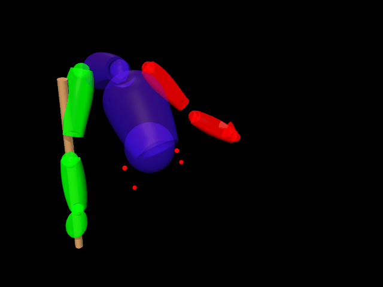 |  |
| **down_short** | 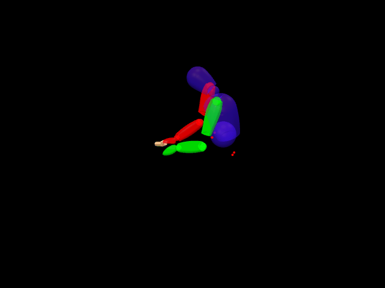 | 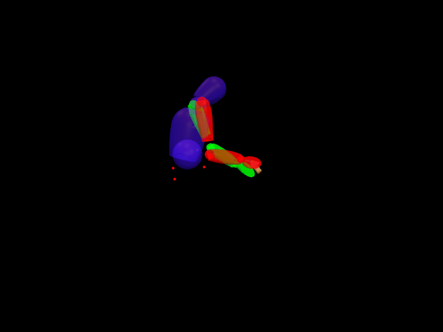 |  |
| **up_long** | 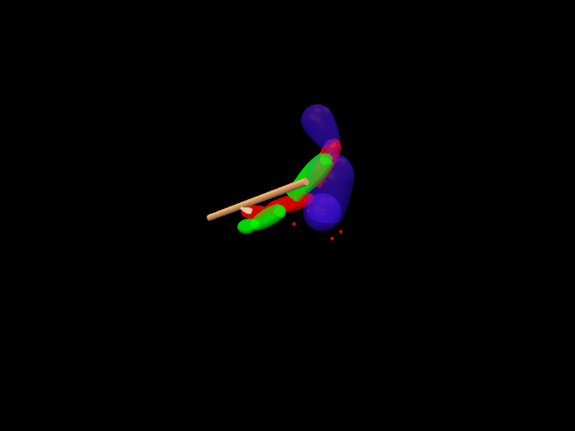 | 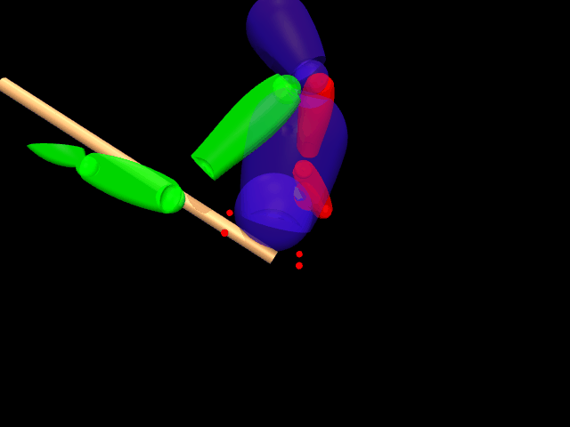 | 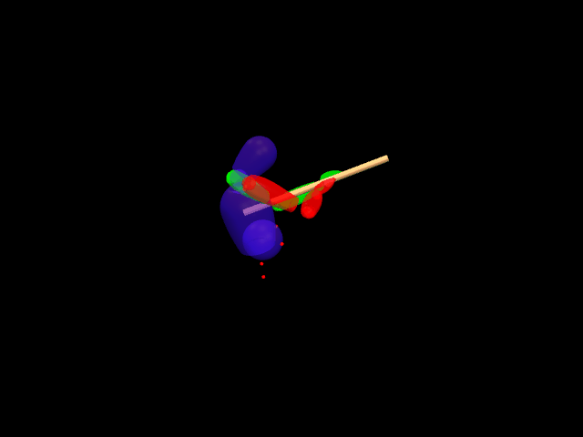 |
| **up_short** |  |  | 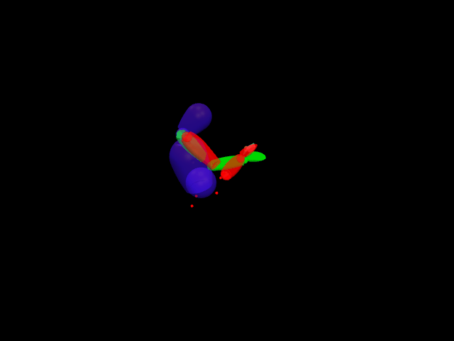 |

## S2

| Task | 13_02 | 27_02_sensor | 27_02 |
|------|-------|-------|-------|
| **down_long** | 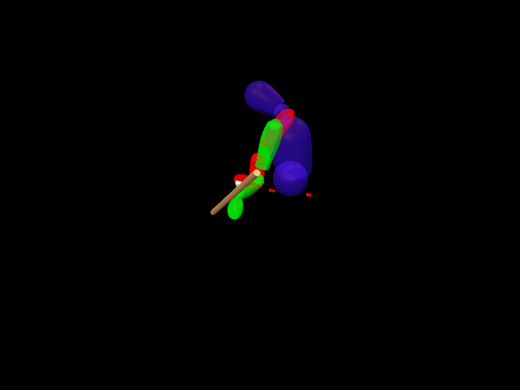 | 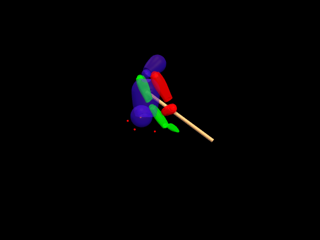 |  |
| **down_short** | 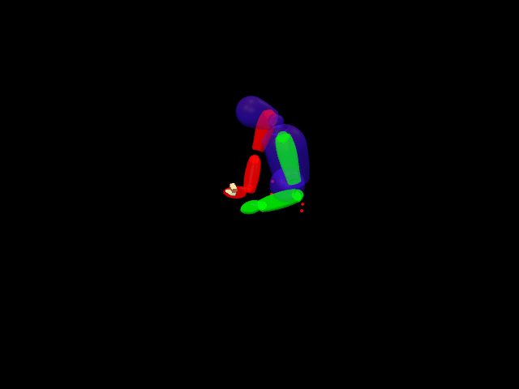 | 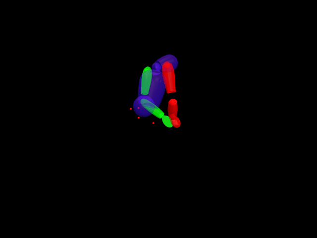 |  |
| **up_long** | 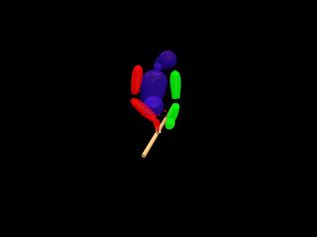 |  | 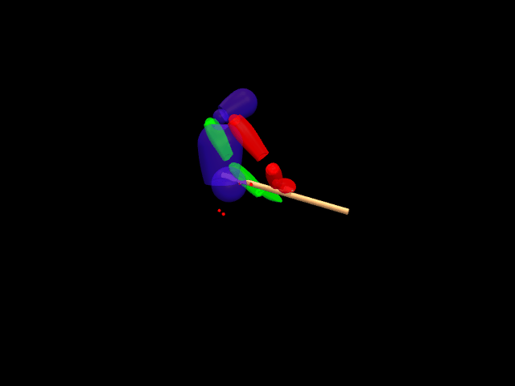 |
| **up_short** | 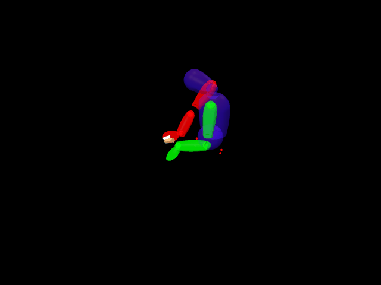 | 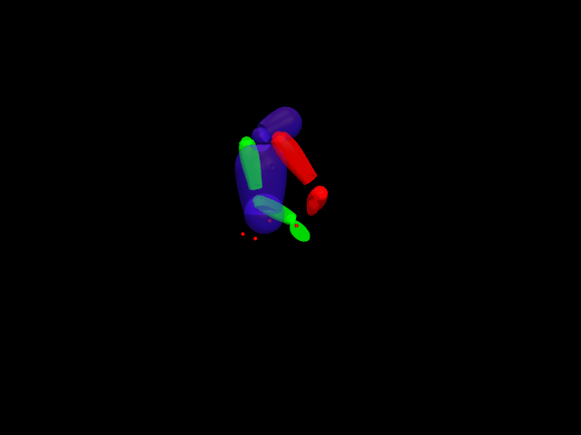 | 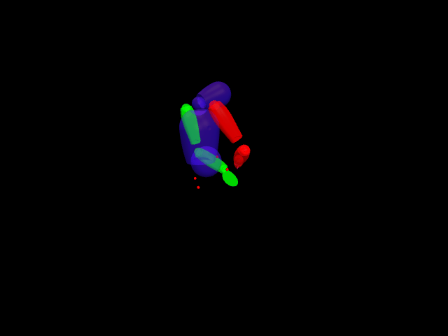 |

## S1

| Task | 13_02 | 27_02_sensor | 27_02 |
|------|-------|-------|-------|
| **down_long** | 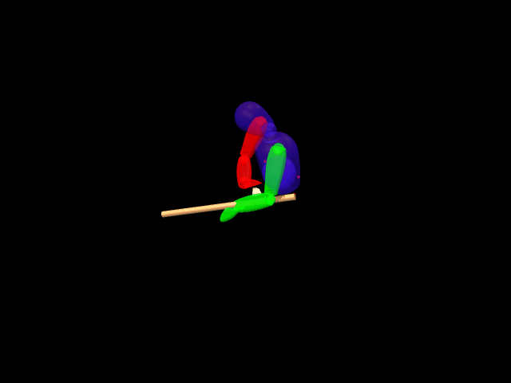 | 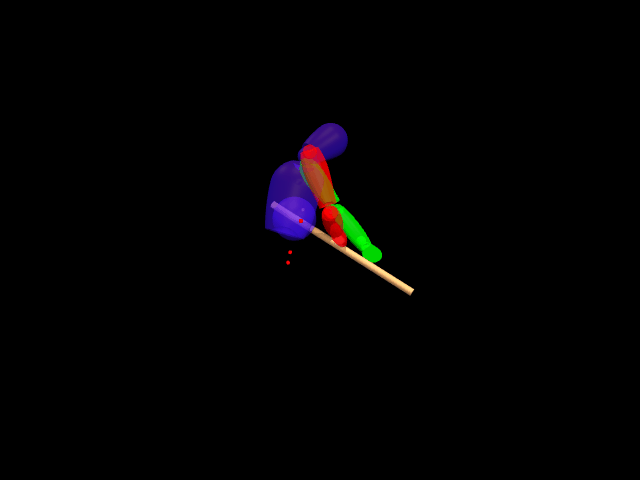 |  |
| **down_short** | 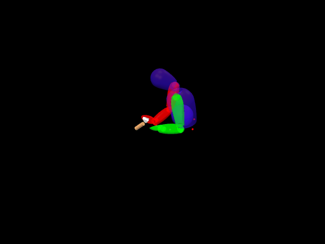 | 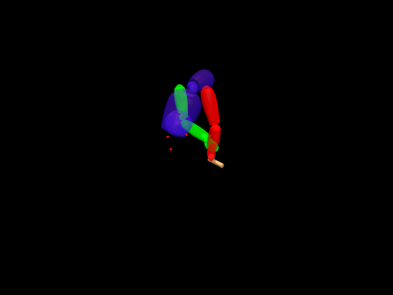 | 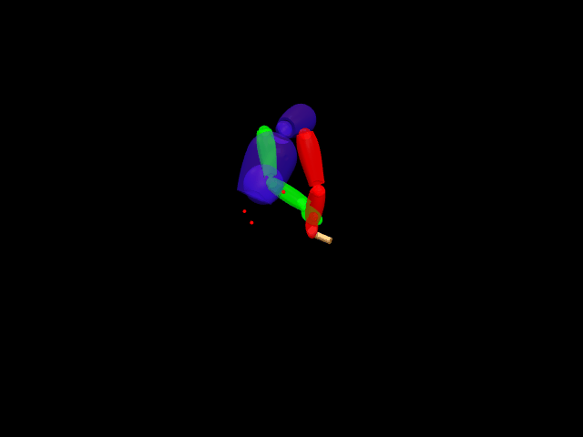 |
| **up_long** | 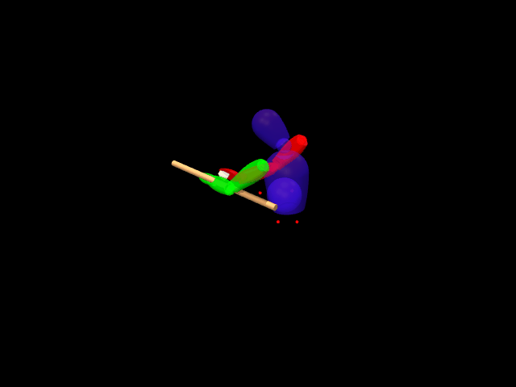 | 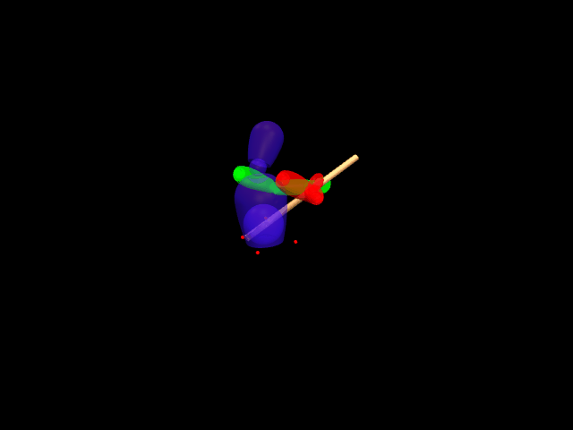 | 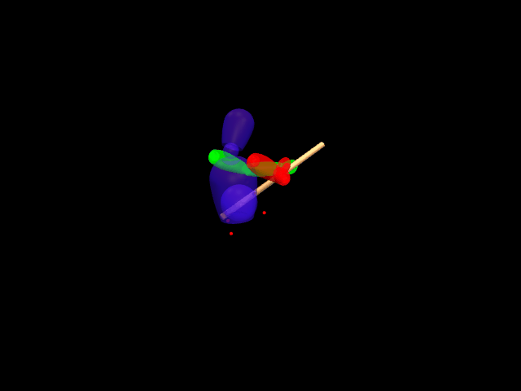 |
| **up_short** | 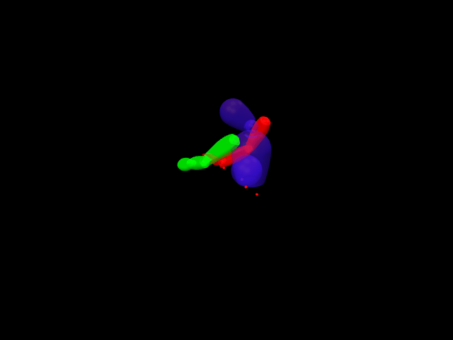 |  | 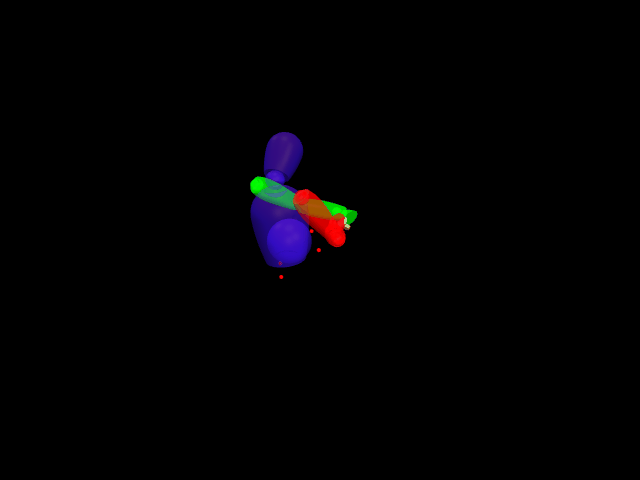 |

