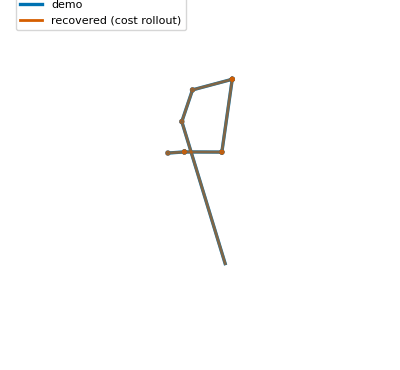
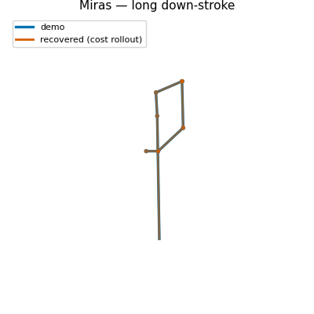
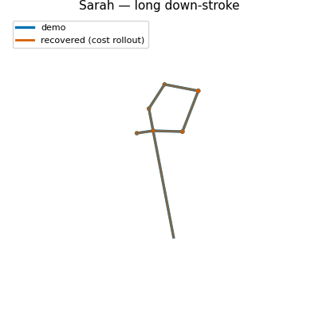
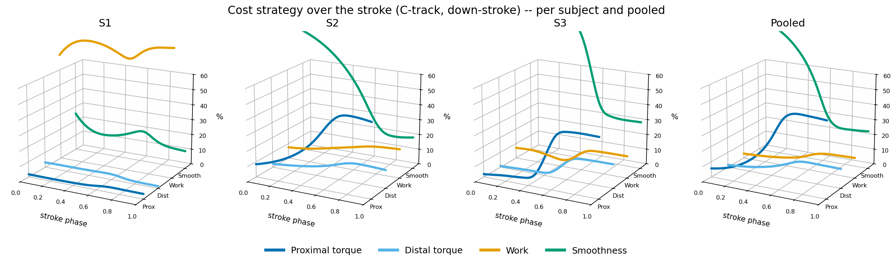
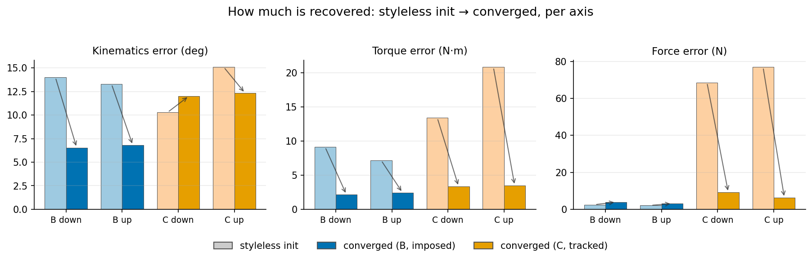
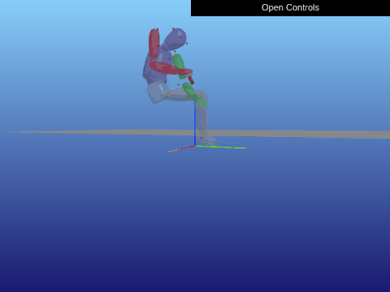
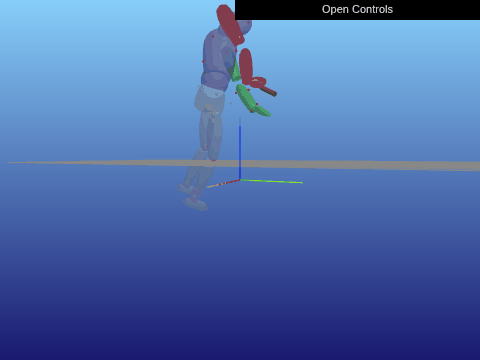
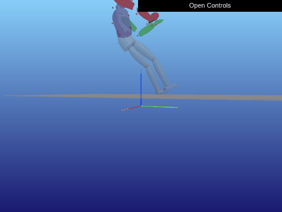
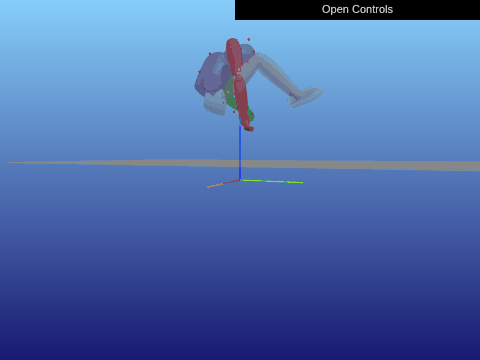

# Results

The recovered cost, how well it generalizes across subjects, takes, and stroke
types, and how the contact-force weight is identified. The headline below is the
short version; the sections that follow give the data pipeline, the two solver
setups, and the full per-subject and population recovery tables.

## Recovered movement

The shared population cost, recovered from the long down-stroke, re-solved on each
subject's own body and overlaid on the recorded demonstration (blue = recorded demo,
orange = rollout under the recovered cost). The two nearly coincide — the recovered
cost reproduces the scraping motion across subjects of different morphology.

<p>



</p>

Raw recorded movements for every subject × take × stroke are on the
[Motion previews](motion_previews) page.

## Headline result

A **single shared, population-level cost** — recovered from a few shaving cycles
across three subjects — reproduces human shaving on each subject's own body and
**predicts held-out demonstrations at ≈ 5.5° mean joint RMSE** (over the eight
active arm DOFs). The recovered cost is dominated by **proximal shoulder-girdle
effort** (clavicle and shoulder torque) and **motion smoothness**; how the pressing
force is treated decides what the recovery can claim about force.

### Three force treatments

Rolling each recovered cost out from a cold start and scoring all three axes —
kinematics, torque, and contact force — against the demonstration:

| Force treatment | Kinematics | Torque | Force |
|---|---|---|---|
| Free ($F^2$) | 3.5° | 3.1 N·m | 11.6 N |
| **Imposed (constraint)** | **2.7°** | **2.2 N·m** | **3.1 N** |
| Tracked (profile) | 4.2° | 3.4 N·m | 11.0 N |

- **Free force collapses.** With no force signal in a demonstration that only pins
  the motion, the force weight goes to zero — the recovery fits the joint *angles*
  well but leaves the force the furthest off (it gets the physics wrong).
- **Imposing the measured force is the cleanest recovery.** It resolves the torque
  null-space, giving the best torque and force at unchanged kinematics. We read the
  recovered cost *structure* from these runs.
- **Tracking the force is the only way to recover a force *weight*.** It carries
  force as ≈ 8% of the cost at good kinematics (4.2°), but recovers the force only
  loosely (≈ 11 N) — the force stays weakly identifiable even when tracked.



*Recovered cost composition over the stroke (per subject and pooled): proximal
effort and smoothness dominate, trading over the stroke phase.*

### How much is recovered

Rolling each cost out from a styleless start (only the task term active) shows each
treatment recovers 50–90% of the error on the axis it targets — the imposed cost the
**kinematics and torque**, the tracked cost the **force and torque** (its force error
crashing from ≈ 70 N to ≈ 8 N):



> Weight ≠ contribution. We rank features by **cost contribution** $w_k\,\bar\phi_k$
> (weight × demo feature value), not by weight alone — a small weight on a
> large-magnitude feature can still dominate. See
> [Method — how to read the IRL weights](method#how-to-read-the-irl-weights).

> **Why the clavicle dominates despite barely moving.** A natural objection: the
> clavicle, which rotates least over the stroke, should not dominate the recovered
> cost. The resolution: `Tau` is a *load* feature, not a motion feature — a
> proximal joint that supports the arm and transmits the press reaction through a
> long moment arm carries large torque while barely moving. Decomposing the
> clavicle joint torque on the down-stroke shows the **press reaction accounts for
> ≈ half of the clavicle torque** (53% / 50% / 66% of the torque-squared energy
> for S3 / S2 / S1), comparable to or larger than the static gravity
> term, with the inertial term negligible (the motion is quasi-static). The
> clavicle load is therefore *task-coupled* — it varies with the press over the
> stroke — which is what makes it an identifiable cost signal, and why the load
> feature `Tau` is retained alongside the work feature `Eng = τ·q̇` (which cannot
> register isometric shoulder-stabilization effort, since the joint is not moving).

### Held-out generalization: pooled vs. subject-specific

The pooled (population) cost is tested against **held-out** cycles, and compared
to a cost fit to each subject alone. Mean per-joint RMSE (degrees), take 27_02:

| Stroke | Subject | Pooled | Subject-specific |
|--------|---------|--------|------------------|
| Long down | S3 | **8.5** | 11.8 |
| | S2 | 5.1 | **4.4** |
| | S1 | **3.4** | 3.9 |
| Long up | S3 | **11.7** | 17.8 |
| | S2 | 2.5 | **2.1** |
| | S1 | **1.8** | 2.2 |

**Pooling generalizes at least as well as a subject-specific fit** for the
variable subjects (S3, S1) and only loses slightly for the most stereotyped
mover (S2) — pooling regularizes against over-fitting a single body's quirks.
Bold = better held-out generalization. (Methodology paper, Table III.)

### Recovery is stable across recording sessions

The same pooled recovery on two independent capture sessions — 27_02 (Evercoast +
ATI force sensor, primary) and 13_02 (OptiTrack, no force sensor). Held-out mean
joint RMSE (degrees):

| Stroke | 27_02 (primary) | 13_02 (second) |
|--------|-----------------|----------------|
| Long down | 5.7 | 6.2 |
| Long up | 5.3 | 16.0 † |
| Short down | 1.7 | 1.0 |
| Short up | 1.8 | 3.5 |

† 13_02 long-up is a segmentation artefact (a 268 ms "stroke" vs ≈ 800 ms on the
primary take), not a recovery failure. Otherwise the two takes agree to within
≈ 1°. Training on 5 cycles improves the long-down held-out to **5.7°** vs **7.2°**
for a 2-cycle split. (Methodology paper, Table IV.)

The agreement is not just in error magnitude but in **cost structure**: on *both*
takes the running cost is dominated by proximal clavicle and shoulder torque plus
joint-acceleration smoothness — clavicle torque accounts for **15–37%** of the
running cost per subject on both takes — confirming the cost reflects the
mechanics of the press, not the recording. The takes differ only in secondary
terms: the **27_02 take (which carries the force sensor) assigns more of the
running cost to the press-force term**, as expected when the force channel is
better aligned with the kinematics.

### Consistency across stroke directions

The shared-cost pattern holds across stroke directions, with one systematic
asymmetry: the **up-stroke (push-away) is consistently harder to fit than the
down-stroke (pull-to)**, most visibly for S3, whose **long up-stroke is the
single hardest case in the study** (11.7° pooled). This is not a method artefact —
the force-sensor study of the same scraping action by Pfleging et al.
independently found push-away gestures to be higher-force and more variable across
subjects than pull-to gestures, exactly the spread we recover.

The **short strokes are not discriminative**: their contact window is a brief
air–scrape–air engagement, leaving little kinematic content to fit, so all costs
collapse to a few degrees regardless of which cost is applied. The
shared-vs-specific conclusion is therefore based on the long strokes; the full
four-stroke per-subject table (with the short-stroke degeneracy and force-tracking
residuals) is in the [appendix tables](#full-per-stroke-recovery-both-takes) below.

## Data and force target

For each demo cycle, we load:

- **Joint trajectory** $q(t),\ \dot{q}(t),\ \ddot{q}(t)$ from mocap IK
  (per-cycle `elaborated/<dir>/cycle_NN.npz`, sliced `[30:-1]`).
- **Per-step contact-force target** $f_{\text{target}}(t)$: a Savitzky-Golay
  smoothed version of the matching force-sensor measurement, resampled onto
  the cycle's timegrid.

### Force loader fallback chain

1. Per-cycle slice CSV at the same date
   (`force_slices/<dir>/cycle_NN.csv`).
2. Raw force recording at the same date (`~/Desktop/recording_<DATE>/force/`)
   aligned + sliced on the fly.
3. **Cross-date reference**: when the requested date has no force recording
   (e.g. 13_02), borrow the same subject's 27_02 cycle profile and resample
   it by normalized cycle progress (0..1) onto the current cycle's timegrid.

A Savitzky-Golay filter (window ≈ 170 ms, polyorder 3) is applied at every
branch, so $f_{\text{target}}(t)$ is a continuous line, not raw sensor
noise. Code: `irl_utils_setup.load_smoothed_force_profile`.

## Crocoddyl forward setup

The Crocoddyl problem wires the smoothed target into **two layers**:

- **Layer 1 — `press_force` cost residual.** Each running IAM's
  `ResidualModelContactForce` reference is set to
  $\mathrm{Force}([0,\,0,\,f_{\text{target}}(t)])$, per timestep. The
  optimizer is pushed toward producing the measured per-step force.

- **Layer 2 — actuation friction.** Every running IAM is built with its own
  `ActuationModelFriction(state, frame_id, \mu, f_{\text{target}}(t))`, so
  the friction reaction in the differential dynamics also tracks the
  measurement:

$$\tau_{\text{act}}(t) \;=\; u(t) \;-\; J_{\text{tool}}^\top \!\left(\mu\,f_{\text{target}}(t)\,\frac{v_{\text{tool}}}{\lVert v_{\text{tool}} \rVert + \varepsilon}\right).$$

Layer 2 is enabled lazily — calling `human.set_force_target_profile(forces)`
rebuilds the solver via `create_solver()` so each timestep gets its own
actuation instance. (Crocoddyl's Python bindings don't expose the actuation
as writable on existing IAMs, so a rebuild is the cheapest path.)

Code: `final_models/human_crocoddyl.HumanCrocoddyl.set_force_target_profile`,
`_build_contact_iam`, `create_solver`.

## MPPI setup (MuJoCo)

The `press_force` feature evaluates

$$\phi_{\text{press}}(t) \;=\; \frac{\bigl| f_{\text{contact}}(t) - f_{\text{target}}(t) \bigr|}{\max(|f_{\text{target}}(t)|,\,1)},$$

where $f_{\text{contact}}(t)$ is read from MuJoCo's `rock_force_sensor` along
the rock-stick normal and $f_{\text{target}}(t)$ is set via
`human_mppi.set_force_target(forces)`. The demo's `_press_forces` are the
forces MuJoCo records while PD-tracking the demo torques — so demo and
rollouts are evaluated by the same simulator dynamics.

Code: `final_models/human_mppi.HumanMPPI.set_force_target`,
`HumanBase.get_traj_features` (press_force branch).

## IRL weight parametrization

For all experiments below we sweep three resolutions of $W(t)$:

- $n_w = 1$ — single global weight vector.
- $n_w = 2,\ 3$ — multiple parameter blocks across the cycle.

Two parametrizations:

- **Windowed**: $W(t)$ is piecewise-constant in $n_w$ chunks (legacy default).
- **Basis** (`--basis`): a soft Gaussian basis,

$$W(t) \;=\; \sum_{k=1}^{K} B_k(t)\,\theta_k,\qquad B_k(t) \propto \exp\!\left(-\frac{(t - \mu_k)^2}{2\sigma^2}\right),$$

with $K = n_w$ centers $\mu_k$ uniformly on $[0,T]$, $\sigma = T/(K-1)$
(auto), rows normalized to partition unity. Decouples resolution ($K$) from
samples-per-parameter ($\sigma$). See
`documentation/08_basis_weights.md`.

## Experiment 1 — S3 and S2 × down_long and up_long (CSQP IRL, n_w sweep)

**Config (shared across all four combos):**

| Item | Value |
|------|-------|
| Subjects | S3, S2 |
| Tasks | down_long, up_long |
| Cycle | 5 |
| Date | 27_02 (sensor take — force recordings available) |
| Slice | frames `[30:-1]`, $T \approx 66$ steps, $dt \approx 9.5$ ms |
| Running features | Eng, Geo, JV, Tau, JTC, JA, progress, press_force |
| Terminal features | JV, Geo, JTC, JA |
| Initial weights | $10^{-6}$ each |
| IRL | `MO_IRL`, `use_mppi_grad=False` (L-BFGS-B inner), `l_reg='elastic'`, `max_iter=50` |
| Force target | per-cycle slice (Savitzky-Golay smoothed) |

Three parametrizations are compared (see [Method — time-varying weights](method#time-varying-weights-windowed-vs-basis)):

- **Windowed.** Piecewise-constant $W(t)$, $n_w$ chunks. Legacy default.
- **Basis.** Soft Gaussian basis with $K = n_w$ centers placed uniformly on $[0, T]$.
- **Adaptive.** Starts in basis mode with $K = n_w$ small, then `solve_with_refinement` inserts new centers where the residual gradient is largest. $K$ grows only where the data supports it.

Each parametrization is swept across $n_w \in \{1, 2, 3\}$.

Run commands (per mode, all four combos at once):

```bash
python run_moirl_batch.py --combos S3_dl S3_ul S2_dl S2_ul \
    --methods csqp_irl --n_w 1 2 3 --mode windowed --max_iter 50
python run_moirl_batch.py --combos S3_dl S3_ul S2_dl S2_ul \
    --methods csqp_irl --n_w 1 2 3 --mode basis    --max_iter 50
python run_moirl_batch.py --combos S3_dl S3_ul S2_dl S2_ul \
    --methods csqp_irl --n_w 1 2 3 --mode adaptive --max_iter 50

# Then plot per combo
for c in S3_dl S3_ul S2_dl S2_ul; do
    python docs/scripts/plot_irl_results.py --combo "$c"
done
```

**Outputs** per run land under
`analysis/moirl/S2_dl/csqp_irl__nw{N}__{mode}/`:

| File | Contents |
|------|----------|
| `weights.json`              | final learned weights, q_norm, duration, settings, $K_\text{final}$ |
| `q_norm.npy`                | full convergence trace |
| `ws_history.npz`            | per-iteration `ws_run` / `ws_term` arrays + key names |
| `xs_irl.npz`                | best-iteration trajectory `xs` |
| `force_target.npy`          | per-step smoothed force target used by Crocoddyl |
| `refinement_history.npy`    | (adaptive only) list of `{ref_iter, K, fcn_val}` entries |
| `plot.png`                  | per-run convergence plot |

After all six runs (3 n_w × 2 modes) complete, generate the cross-run figures with:

```
python docs/scripts/plot_irl_results.py --combo S2_dl
```

### How to read each figure

Each per-combo section below contains the same six figure types. Pointers
on what to look for, so the per-combo notes can stay terse:

- **Convergence** — $q_{\text{norm}}$ vs IRL iteration. Solid = windowed,
  dashed = basis, dotted = adaptive. Lower is better. Adaptive's curve
  steps down each time a new basis center is inserted (the inner solve
  restarts on the augmented basis). If `windowed` plateaus while `basis`
  keeps falling, the staircase parametrization is the bottleneck.
- **Smoothed force target** — the per-step $f_{\text{target}}(t)$ that
  Layers 1 + 2 of the Crocoddyl problem track. Read where the force peaks
  to identify the contact phase of the cycle.
- **Learned weights per parameter block** — final $w_k$ per feature, one
  row per run within the combo. Weights are normalized within each block.
  - For **windowed**, block $k$ is the $k$-th time chunk of $W(t)$.
  - For **basis**, block $k$ is a Gaussian centered at
    $t_k = (k-1)\,T/(K-1)$.
  - For **adaptive**, block $k$ is a Gaussian inserted by the refinement
    procedure (see `refinement_history.npy` for the order).
- **Cost contributions per block** — $w_k \cdot \bar\phi$, the *true
  importance*. A feature with a tiny weight but a huge $\phi$ can still
  dominate the cost; this collapses both into one bar.
- **Basis function activation** *(basis/adaptive only)* — the Gaussian
  curves $B_k(t)$. Shows where each $\theta_k$ has support; with auto
  $\sigma = T/(K-1)$, neighbours overlap ~50% and rows partition unity.
- **Basis function influence** *(basis/adaptive only)* — the recovered
  $W_j(t) = \sum_k B_k(t)\,\theta_{k,j}$ per feature. Tells you *which
  features the IRL emphasises at which phase of the cycle* — e.g.
  force-tracking weight peaks during contact, smoothness peaks during
  free motion.

> **Note on terminal weights.** The OCP has a single terminal cost at
> $t=T$, so only the last block's terminal weights actually feed
> Crocoddyl. Earlier blocks' terminal entries appear in plots / tables
> but are dead parameters pulled toward zero by elastic-net regularization;
> they don't affect the solve. Treat them as "unused".

---

---

### CSQP recovery: per-subject and population

Run with the locked CSQP recipe (static stick, fixed contact normal,
demo-seeded $v_0$, measured force target, K = 10 Gaussian basis, elastic-net
$\beta = 10^{-3}$, contiguous early cycles 3–5; see
[`papers/csqp_results.md`](https://github.com/Anastasija42/tool_handling/blob/master/papers/csqp_results.md)).
$q_{\text{norm}} = $ joint RMSE $+\,0.1\cdot$ force RMSE. "press_force recovered"
means the contact-force weight climbs off the $10^{-6}$ floor — the hardest
feature to identify because it lives on a near-flat cost direction.

**Per-subject** (avg/max are the recovered `press_force` cost share):

| Subject | Task | $q_{\text{norm}}$ | press_force (avg/max) | Top cost terms |
|---------|------|-------------------|------------------------|----------------|
| S3 | down_long | 8.96 | **0.029 / 0.155** ✓ | Eng_elbow 0.19, JTC 0.09, Eng_thoracic 0.06 |
| S3 | down_short | 6.44 | 0.004 / 0.019 (floored) | Tau_thoracic 0.19, JTC 0.13 |
| S3 | up_short | 1.00 | 0.008 / 0.030 (floored) | JA 0.20, JTC 0.06 |
| S2 | down_short | **0.18** | **0.16 / 0.53** ✓ | Eng_clavicle 0.27, JV 0.27, press_force 0.16 |
| S2 | up_short | 0.54 | **0.33 / 1.00** ✓ (top term) | press_force 0.33, Tau_shoulder 0.14, JV 0.08 |
| S1 | down_long | 7.06 | **0.14 / 0.58** ✓ | JTC 0.19, press_force 0.14, Eng_clavicle 0.09 |
| S1 | up_long | 0.76 | **0.21 / 1.00** ✓ (top term) | press_force 0.21, JTC 0.12, Eng_shoulder 0.05 |

`press_force` sits on a degenerate, near-flat cost direction, so its recovery is a
**partial, somewhat stochastic** matter of whether the optimizer enters the press
basin — fit quality alone does not predict it (S3 up_short fits tightly yet
floors; S2 up_short fits loosely yet recovers).

**Population (3-subject pooled, K = 10)** — pooling across subjects is the robust
way to identify the force weight:

| Task | $q_{\text{norm}}$ | press_force (avg/max) | Top cost terms |
|------|-------------------|------------------------|----------------|
| down_long | 12.6 | **0.038** ✓ (stable) | JTC 0.16, JA 0.13, Geo 0.04 |
| up_long | 9.1 | **0.082 / 0.130** ✓ | JTC 0.18, press_force 0.08, JA 0.08 |
| up_short | 0.90 | **0.29 / 1.00** ✓ (top term) | press_force 0.29, Eng_clavicle 0.29, JA 0.19 |
| down_short | 9.5 | uniform (not learned) | uniform |

**Pooling recovers `press_force` on 3 of 4 strokes — including up_long, which
failed for every individual subject.** The lone hold-out is down_short, where the
pooled gradient washes out. Net: pooling across subjects is the recommended
recovery mode.

**Resolution sweet spot.** A K-sweep on S3 down_long shows recovery needs the
temporal resolution to match the force's structure — about **ten knots over the
stroke**:

| Weight model | K / $n_w$ | train $q_{\text{norm}}$ | press_force | |
|--------------|-----------|--------------------------|-------------|---|
| basis | 6 | 3.89 (best fit) | 0.002 / 0.007 | floored |
| basis | 10 | 8.96 | **0.029 / 0.155** | ✓ recovered |
| basis | 16 | 8.59 | 0.006 / 0.081 | floored |
| windowed | $n_w$=5 | 6.55 | 0.001 | floored |
| windowed | $n_w$=10 | 4.67 | **0.023 / 0.027** | ✓ recovered + tightest fit |

K = 6/16 and $n_w$ = 5 are too coarse/fine and floor the force weight; ≈ 10
temporal segments both recovers `press_force` *and* gives the tightest fit.

### Trajectory visualization (meshcat ghost overlay)

Following the pattern from `MO_IRL_mocap.ipynb`, the IRL-optimal trajectory
$\xi^\star$ is rendered alongside the demo as a semi-transparent grey
"ghost" so the deltas are visible. Run after IRL finishes:

```python
import pinocchio as pin, meshcat.geometry as g, numpy as np
from copy import deepcopy

# Two visualizers sharing one viewer — main = optimal, ghost = demo.
viz       = pin.visualize.MeshcatVisualizer(human.pin_model, human.collision_model,
                                             deepcopy(human.visual_model))
viz.initViewer(open=True); viz.loadViewerModel()

ghost     = pin.visualize.MeshcatVisualizer(human.pin_model, human.collision_model,
                                             deepcopy(human.visual_model))
ghost.initViewer(viz.viewer)
ghost.loadViewerModel(rootNodeName="ghost",
                       color=np.array([0.6, 0.6, 0.6, 0.4]))

xs_irl  = np.load("analysis/moirl/S2_dl/csqp_irl__nw3__basis/xs_irl.npz")["xs"]
xs_demo = xs_opt_list[0]
T = min(len(xs_irl), len(xs_demo))

import time
for t in range(T):
    viz.display(xs_irl[t,  :human.nq])    # opaque: IRL solution
    ghost.display(xs_demo[t, :human.nq])  # ghost:  demo
    time.sleep(human.dt)
```

The IRL-optimal rollout (opaque) overlaid on the demo (grey ghost) for several
combos — the two stay locked together through the scrape, which is the recovered
cost reproducing the demonstrated motion:

<p>



</p>
<p>


</p>

## Experiment 2 — cross-date reference (13_02 borrows 27_02 force shape)

**Setup:** Same subject and task as Experiment 1, but date 13_02 (no
force sensor on that day). The smoothed target is the 27_02 force profile
from the same cycle, resampled by normalized cycle progress onto the 13_02
cycle timegrid.

**What this tests:** whether IRL with a borrowed force *shape* (constant
peak magnitude across subjects, but matching phase) recovers similar
dominant features to a same-date force target. If yes, the cross-date
fallback is a viable substitute for missing sensor data.

**Result.** Recovery is stable across the two sessions: the pooled cost recovered
on 13_02 agrees with 27_02 to within ≈ 1° held-out RMSE on every stroke except the
13_02 long-up, which is a segmentation artefact (a 268 ms "stroke") rather than a
recovery failure — see the [Recovery is stable across recording
sessions](#recovery-is-stable-across-recording-sessions) table above. The
cross-date force *shape* is a viable substitute for missing sensor data.

## Experiment 3 — Crocoddyl forward vs MPPI on the same demo

**Setup:** Run the same Experiment 1 demo through both `csqp_irl`
(Crocoddyl forward, Layer 1 + Layer 2 force target) and one of the MPPI
methods (`mppi_2phase` or `mppi_3phase`, with HumanMPPI's
`set_force_target`).

**What this tests:** how the analytic-gradient Crocoddyl pipeline and the
sampling-based MPPI compare on the same force-tracking task. Same demo,
same target, different inner solvers.

**The recovered cost structure agrees across the two solvers.** Across all three
subjects the sampling MPPI solver recovers the same structure as the constrained
CSQP solver: a dominant joint-smoothness term (JA) plus proximal load at the
shoulder girdle, both ramping through the stroke. The most clearly identified case
(S2) places the largest recovered weight on **JA (+0.47 over seed)**, then
**joint velocity (+0.26)**, then proximal energy that decays distally
(**Eng_shoulder +0.18 > Eng_elbow +0.09 > Eng_wrist +0.04**). The one apparent
difference — CSQP loads proximal effort onto **torque (Tau)** while MPPI loads it
onto **energy (Eng)** — is an attribution *within* a known collinear pair (Tau and
Eng differ only by the velocity weighting), not a disagreement about which segment
bears the cost.

**Held-out generalization (CSQP vs MPPI).** Both solvers generalize comparably.
That two solvers with *opposite* contact treatments — a windowed hard constraint
vs. full-stroke emergent contact — land within one to two degrees on held-out
strokes is the main cross-engine result:

| Subject | CSQP (OCP) | MPPI |
|---------|-----------|------|
| S3 | 8.5 | 7.7 |
| S2 | 5.1 | 6.7 |
| S1 | 3.4 | 5.7 |

The sampler is more accurate for S3; the constrained solver edges it for the
lighter pressers (S1, S2) by one to two degrees — consistent with the toy
finding that the explicit force dual is most valuable when the demonstrated force
is small and the sampled force-coupled gradient is noisiest.

**Held-out force tracking.** The recovered MPPI rollout tracks the demonstrated
press force in level and coarse profile but does not pin the magnitude: for the
consistent presser **S2 the smoothed force RMSE is 11.7 N on a ≈ 26 N signal**,
while the heavier **S3 is underestimated (20.0 N RMSE)** at the peak. (S1's
held-out force trace carries a load-cell artifact — a > 300 N spike inconsistent
with her light press — so her force comparison is omitted, though her joint
recovery is not.) The contact force is thus recovered as a **presence/level, not a
precisely regulated magnitude** — see [Identifiability — why a force weight needs
the right inner solver](identifiability#why-a-force-weight-needs-the-right-inner-solver).

Both solvers share the same MaxEnt outer loop; they differ only in the
[step rule](method#gradient-step-rule-which-step-rule-for-which-solver)
(L-BFGS-B for the deterministic OCP, masked SGD for the stochastic MPPI).
(Methodology paper, Table V.)

## Per-feature normalization scale

Initial weights are all $10^{-6}$, but feature magnitudes span orders of
magnitude (rough estimates from the canonical setup):

| Feature   | $\phi$ scale |
|-----------|-------------|
| Eng       | ~5 – 10 |
| Geo       | ~1 |
| JV        | ~3 500 |
| Tau       | ~7 500 |
| JTC       | ~15 000 |
| JA        | ~5 × 10$^{12}$ |
| progress  | ~0 – 1 |
| press_force | ~0 – 100 |

The $10^{-6}$ initialization keeps the cost balanced enough for IRL to
move on every feature. Final learned weights — once normalized — express
relative importance.

## Full per-stroke recovery (both takes)

Held-out recovery for all strokes, both takes, at the five-train / five-held-out
split. Each long-stroke cell is **joint RMSE (deg) / force RMSE (N)**, averaged
over the five held-out cycles. The press-force term is deliberately down-weighted
(force weight **0.05**) so kinematics drives the selection, so the force residual
is larger relative to its scale. Read force RMSE against each subject's measured
mean press: **≈ 39 N (S3), 18 N (S2), 10 N (S1)**.

**Long strokes — pooled vs. subject-specific, both takes:**

| Stroke | Subject | 27_02 Pooled | 27_02 Specific | 13_02 Pooled | 13_02 Specific |
|--------|---------|--------------|----------------|--------------|----------------|
| Long down | S3 | 8.5 / 20 | 11.8 / 28 | 9.5 / 3 | 12.2 / 12 |
| | S2 | 5.1 / 6 | 4.4 / 9 | 2.2 / 2 | 6.2 / 10 |
| | S1 | 3.4 / 7 | 3.9 / 8 | 7.0 / 7 | 7.8 / 7 |
| Long up | S3 | 11.7 / 2 | 17.8 / 11 | 19.1 / 6 † | 19.1 / 6 † |
| | S2 | 2.5 / 2 | 2.1 / 2 | 26.3 / 3 † | 14.5 / 3 † |
| | S1 | 1.8 / 2 | 2.2 / 2 | 2.8 / 4 | 2.8 / 6 |

† Segmentation artefact on the 13_02 take (the long up-stroke was mis-sliced for
*two* of three subjects, S3 and S2), collapsing the recovered running cost
onto the task-progress term and inflating held-out error to **19–26°**; excluded
from the shared-vs-specific conclusion. On the 13_02 down-stroke the pooled cost
beats the subject-specific cost for **all three** subjects.

**Short strokes — pooled cost only (not discriminative):**

| Stroke | Subject | 27_02 (joint / force) | 13_02 (joint / force) |
|--------|---------|------------------------|------------------------|
| Short down | S3 | 3.4 / 15 | 2.0 / 3 |
| | S2 | 0.6 / 19 | 0.1 / 4 |
| | S1 | 1.3 / 4 | 0.8 / 3 |
| Short up | S3 | 4.6 / 3 | 8.0 / 14 |
| | S2 | 0.2 / 2 | 1.6 / 9 |
| | S1 | 0.4 / 6 | 1.0 / 6 |

The short strokes' brief mid-stroke contact window leaves little kinematic content
to constrain the cost, so the sub-degree errors are uninformative rather than
excellent. (Methodology paper, Tables VII–VIII.)

---

[Home](.) | [Method](method) | [Identifiability](identifiability) | [Cross-Morphology](morphology) | [Gallery](gallery) | [Code](code)