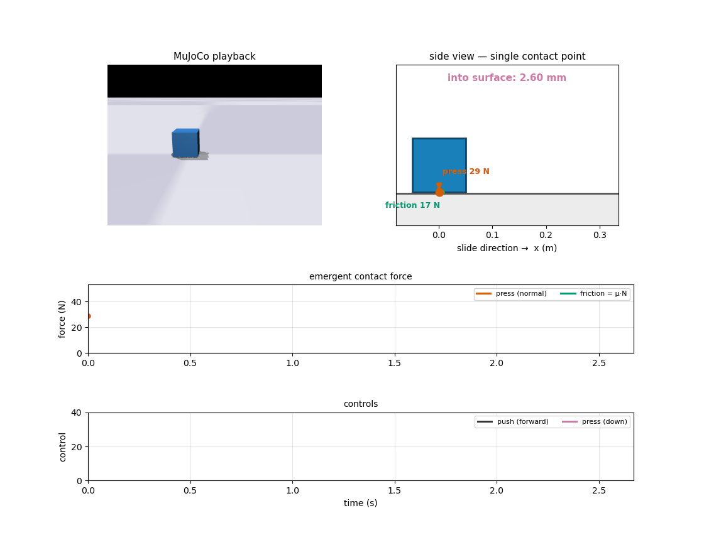
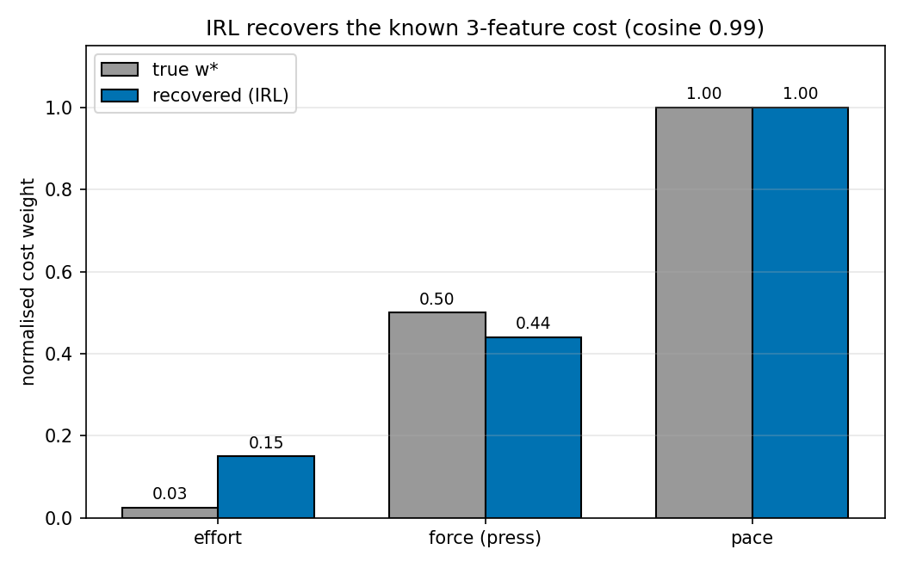
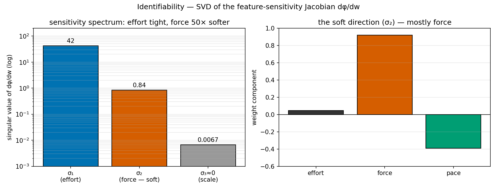
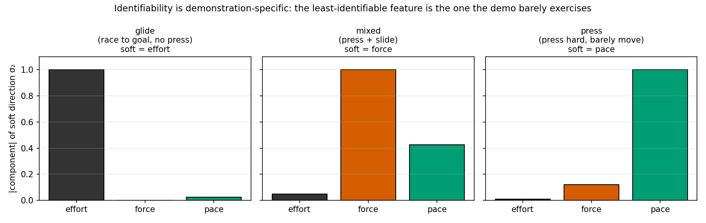
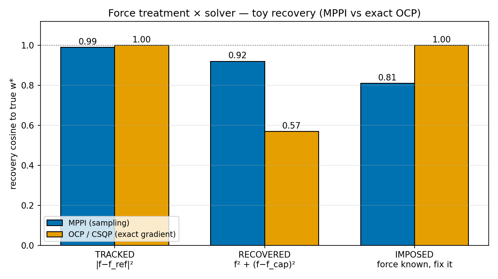
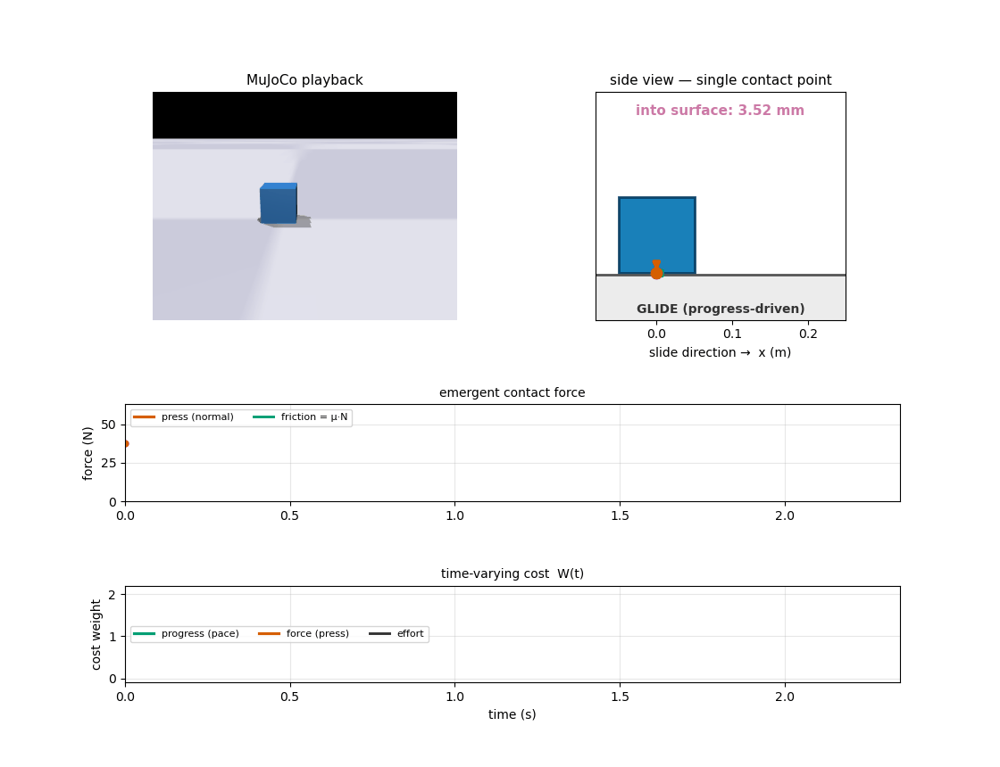
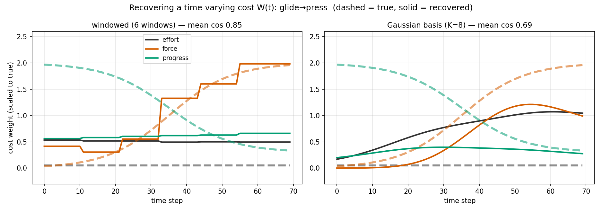

# A point on a surface: the whole project in miniature

Everything in this project comes down to one question:

> **A person scrapes a stone tool across a stick. Why do they move the way they do?**

They press the tool into the surface, drag it along, and stop. Hidden inside that
motion is a *cost* the hand is optimising — some trade-off between **effort**
(how hard the muscles work), **force** (how hard to press the tool down), and
**pace** (how fast to travel). We never see that cost directly. We only see the
motion and a measured contact force, and we try to **recover the cost** from them
with inverse reinforcement learning (IRL).

That is a hard problem wrapped in a hard problem: the physics is *contact-rich*
(a sliding press with friction), and the recovery is *ill-posed* (several
different costs can explain the same motion). Before trusting any answer on the
real arm, we test the entire idea on a problem small enough that we know the
**true** answer.

That test is the toy box.

---

## The analogy

<div align="center">

</div>

*The four panels are synced: the **MuJoCo playback** (top-left), a **side view**
showing the single contact point and how far the point presses into the surface,
the **emergent contact force** read from the simulator (normal press + the friction
it drives), and the **controls** (push forward / press down) that produced it.*

A single point — a small ball that **cannot spin** — slides on a flat surface. It
has exactly two things it can do: **push** itself forward, and **press** itself
down into the surface. As it slides, **Coulomb friction (μ = 0.6)** at the contact
point resists the motion, and that friction is set by how hard the point presses
(friction = μ · normal force). You can see both forces in the animation: the
orange arrow is the press (normal), the green arrow is the friction it generates.

This is the stone-tool task stripped to its skeleton:

| Toy box | Stone-tool scraping |
|---|---|
| a non-spinning point | the tool tip on the stick (a single contact point) |
| **push** DOF | the arm driving the tool along the stick |
| **press** DOF | the hand pressing the tool into the surface |
| Coulomb friction μ·N | the same friction resisting the scrape |
| cost  | *effort · force-tracking · pace* |

Same contact structure, same three cost axes, same recovery question — but here we
**generate the demonstration ourselves** from a cost we choose, so we know exactly
what the answer should be.

---

## The setup

* **One contact point.** The visual "box" is cosmetic; the real collision geometry
  is a single tiny sphere at the base. A single point cannot chatter between
  corners the way a flat box does, so the contact force is clean — the same reason
  the full model represents the rock as a sphere rather than a mesh.
* **The force is read from the simulator, not prescribed.** We do not tell the
  point how hard it presses; we let MuJoCo resolve the contact and *read back* the
  emergent normal force at the point. Whatever the controller does, the force is a
  genuine physical reaction. Friction comes with it for free.
* **A known ground truth.** We pick a cost `w*` = (effort, force, progress), run an
  optimal controller under it to produce an "expert" slide, and then hand only the
  resulting motion + force to the IRL. Because we know `w*`, recovery is measured
  directly as the direction cosine between the recovered weights and `w*`
  (1.0 = perfect) — no eyeballing a trajectory fit.

**The three features** (control `u = [push, press]`, contact normal force `N`, position `x`):

- **effort** `= ‖u‖ / 60` — the control magnitude (how hard the actuators work).
- **force** `= |N − N*| / N*` — deviation of the normal force from the target `N* = 30 N`.
- **pace** `= (x_goal − x) / x_goal` — distance still to travel (`x_goal = 0.3 m`).

---

## What we recover

<div align="center">

</div>

The IRL recovers the known cost at **cosine 0.99**:

| cost axis | true `w*` | recovered |
|---|---|---|
| **progress** (pace) | 1.00 | **1.00** |
| **effort** | 0.025 | 0.15 |
| **force** (press) | 0.50 | **0.44** |

**Pace is recovered exactly. Effort is recovered in the right place. Force is
recovered close, but is the least certain** — and *that is the key lesson*, not a
defect.

### How well can the force be pinned down?

The press weight is the hardest to identify, because **force and effort are
entangled**: pressing harder and working harder both change the same contact in
almost the same way, so the data cannot fully separate "how hard to press" from
"how hard to work". The IRL lands near the true value (0.44 vs 0.50) but with the
most slack of the three.

This is exactly what we find on the real arm, and it tells us **how the force
should be treated**:

* **Pace and effort are strongly recoverable** — the demonstration genuinely pins
  them down, so we report them as recovered cost.
* **The press force is weakly identifiable** — it is best treated as a **tracked
  boundary condition** (we measured it) rather than a freely-recovered weight. The
  toy shows this is a property of the *problem*, not a bug in the solver: even with
  a perfect, known ground truth and clean physics, the force is the axis the data
  constrains least.

---

## Identifiability — reading the SVD

The IRL sees the demo only through its feature counts, so it can tell two cost weights
apart only if changing them changes the demo *differently*. The exact object is the
**feature-sensitivity Jacobian `dφ/dw`** — how the demo's feature counts shift when you
nudge each weight, measured by re-solving the OCP at perturbed weights (an exact-gradient
computation the CSQP solver makes cheap). Its **SVD** reads identifiability off directly:

<div align="center">

</div>

**Left — the singular values of `dφ/dw`.** A large one is a weight-direction the demo
responds to strongly (well identified); a small one is a direction you can move the weights
along *without changing the demo* — weakly identified. **Right — the soft direction (σ₂):**
the weight combination the demo constrains least.

The spectrum is **`S ≈ [42, 0.8, 0.007]`**. The strong direction (σ₁) is **effort** —
tightly pinned. The next, σ₂, is **50× softer and is mostly force** (right panel): moving
the weights along it changes the contact force but barely the motion, so it takes a *force
measurement*, not kinematics, to constrain the force weight. The last (σ₃ ≈ 0) is the
trivial reward-*scale* freedom (along `w*`), which no IRL can resolve.

So the honest picture: **effort and pace are well identified; the force weight is the loose
axis** — recoverable in direction but weakly conditioned — which is exactly why we track or
impose the measured force rather than freely recover it. (Effort looked unrecoverable in the
time-varying run only because *that* demo gave it ≈ 0 weight — no signal, not
inseparability.)

**One caveat that is really the point.** `dφ/dw` is the sensitivity of *this* demo's own
optimum — the KKT point of the inner problem — so the spectrum measures what this particular
motion **exercises**, not an absolute property of the feature. It's the same local-KKT
reading used to assess inverse-optimal-control *reliability*. Change the demonstration and
the geometry changes: a demo that varied the contact force more, or a stiffer contact that
couples force into the motion, would put more of the force's footprint on the observable
trajectory and pin its weight more tightly. So identifiability is always **more or less**,
relative to the states and actions the demonstration shows — never absolute.

We can watch this happen. Run the same KKT-SVD on three different demos and the soft
direction moves:

<div align="center">

</div>

A **glide** (racing to the goal, no press) can't pin **effort**; a heavy **press** (barely
moving) can't pin **pace**; the **mixed** scrape can't pin **force**. In each case it's the
feature the motion barely exercises — the least-identifiable axis is read off the
demonstration, not the cost.

---

## Three ways to treat the force

Given that the force is the loose axis, *how* we put it into the cost matters. Three
options, tested on the toy against the known `w*`:

| treatment | force in the cost | cosine to `w*` |
|---|---|---|
| **Tracked** | `\|f − f_ref\|` toward the **measured** reference | **0.99** |
| **Recovered** | two costs `f²` + `(f − f_cap)²`; the level emerges from their *ratio* | **0.92** |
| **Imposed** | press **clamped** to the known value (`u₁` fixed → `N ≈ 30 N`), not a feature | **0.81** |

**Tracked** is the workhorse: we *measured* the force, so we penalise deviation from it and
let the IRL recover the motion costs — this is what the arm experiment uses. **Recovered**
is the ambitious version (explain *why* the force is what it is), but the hardest to
identify — the two force costs are redundant, so only their *ratio* is pinned (operating
force ≈ 34 N vs demo 30 N), not the individual weights. **Imposed** is the fallback when the
force is unidentifiable: fix it, recover the rest — trivial here, the practical route on the
9-DOF arm.

Why it matters: the animation's lift-off shows the force is a live DOF, so **tracked** and
**imposed** hold the contact, while **recovered** can let the press decay and the contact
break.

---

## The same test with an exact solver (OCP)

Everything above uses the sampling-based **MPPI**. But the recovery method is
solver-agnostic — the arm study also runs an **exact-gradient optimal-control solver**
(CSQP / crocoddyl). Running the *identical* three force treatments through both, on the
same toy:

<div align="center">

</div>

| force treatment | MPPI (sampling) | OCP (exact gradient) |
|---|---|---|
| **tracked** | 0.99 | **1.00** |
| **recovered** | 0.92 | **0.57** |
| **imposed** | 0.81 | **1.00** |

**Tracked and imposed are well-posed**, so the exact OCP nails them (1.00), beating MPPI's
sampling noise. **Recovered is degenerate for both** — and the exact solver scores *lower*
(0.57), which is it being honest: the two force costs are collinear (only their ratio is
defined), so it walks down the flat valley and redistributes the weights while MPPI's noise
lingers near the symmetric start. Neither pins the individual costs, because they are not
identifiable — the same lesson as the SVD, and the reason we track or impose the measured
force rather than freely recover it.

---

## The cost can change over the stroke

Nothing forces the cost to be *constant*. A real scrape has phases: you first **drive
the tool to the surface** (pace matters, force does not yet), then you **press and
scrape** (now force matters, pace backs off). So the natural next step is a
**time-varying** cost `W(t)` — and the toy lets us test whether the IRL can recover
one when we know the truth.

We give the demo a smooth **glide→press** cost: `progress` starts high and decays,
`force` starts at zero and rises, `effort` stays flat — a sigmoid hand-off centred
mid-stroke. The point glides toward the goal, then settles into a press:

<div align="center">

</div>

*Same panels as before, but the fourth now shows the **time-varying cost `W(t)`**: the
green (pace) and orange (press) weights cross over mid-stroke, and the phase label
switches from GLIDE to PRESS. This is the toy version of the arm's approach→scrape.*

**Recovering `W(t)`** uses the *same two parameterizations as the 9-DOF arm*:
a **windowed** cost (piecewise-constant over N windows) and a **Gaussian basis**
(a few smooth bumps, `W(t) = B(t)·θ`). Both recover the known hand-off:

<div align="center">

</div>

| parameterization | mean cosine to true `W(t)` |
|---|---|
| **Windowed** (6 windows) | **0.85** |
| **Gaussian basis** (K=8 bumps) | **0.69** |

The **windowed** cost recovers the hand-off cleanly; the smooth **basis** is weaker at
this size (too few bumps to place the transition sharply, the same representation-vs-
starvation trade-off the arm study tunes). Both nonetheless put the pace→press crossover
in the right place.

The dashed curves are the true `W(t)`, the solid are recovered. The crossover — *when*
the cost switches from pace to press — is recovered cleanly; this is exactly the
time-profile the arm study reports as its "money plot" (effort/smoothness ramping late
in the scrape). The toy confirms the machinery recovers a *when*, not just a *how much*.

---

## Why this matters for the rest of the project

The toy box is the sanity check that licenses everything downstream. It shows, on a
problem where we know the answer, that:

1. the emergent single-point contact force is **stable and honest** (read from the
   simulator, friction included);
2. MO-IRL **recovers a known cost** through contact-rich sliding dynamics; and
3. the **force is the weakly-identified axis** — recover pace and effort, track the
   force.

When we scale up to the human arm scraping a rock, the physics gets bigger but the
story is the one you can watch in the animation above: a point pressing and sliding
on a surface, and the search for the cost that explains it.

---

## Reproduce

Every number and figure on this page regenerates from the repo root
(`conda activate unified_env` first):

```bash
# Recovery + the three force treatments — MPPI (sampling solver)
python experiments/run_toy_ablation.py --iters 15 \
    --only 08_force_tracked,09_force_recovered,10_force_imposed

# The same three, exact-gradient OCP (CSQP / crocoddyl)
python experiments/run_toy_csqp_ablation.py \
    --only 08_force_tracked,09_force_recovered,10_force_imposed

# Time-varying W(t): the glide→press hand-off (windowed + Gaussian basis)
python src/run_tv_smooth.py --iters 25 --T 80

# Identifiability — the feature-count SVD
python docs/scripts/plot_toy_identifiability_svd.py

# The MPPI-vs-OCP comparison bar chart
python docs/scripts/plot_toy_mppi_vs_ocp.py

# Animations (MuJoCo EGL render → gif)
MUJOCO_GL=egl python docs/scripts/gen_toy_box_animation.py
MUJOCO_GL=egl python docs/scripts/gen_toy_tv_animation.py
```

The full ablation (baseline, sampling/step-size checks, glide/press basins,
no-press) is `python experiments/run_toy_ablation.py` and its CSQP counterpart
`python experiments/run_toy_csqp_ablation.py` with no `--only` filter.
